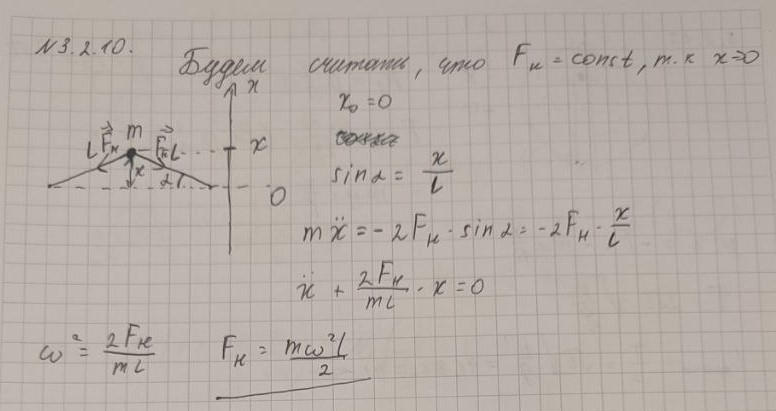

###  Условие 

$3.2.10.$ Измерения круговой частоты колебаний тела массы $m$, закрепленного посередине натянутой струны, длина которой $2l$, дали значение $\omega^*$ . Найдите силу натяжения струны. 

### Решение

Суммарная внешняя сила, действующая на систему $$F=2T\sin\varphi$$ Второй закон ньютона $$m\ddot{x}(t)+2T\sin\varphi=0$$ Воспользуемся приближением для маллых углов $(\varphi \ll 1)$: $$\sin\varphi\approx\varphi=\frac{x}{l}$$ Уравнение гармонических колебаний $$\ddot{x}(t)+\frac{2T}{ml}x(t)=0$$ Откуда, период колебаний $$\omega^{*2}=\frac{2T}{ml}\Rightarrow \boxed{T=\frac{ml\omega^{*2}}{2}}$$ 

###  Альтернативное решение: 

 

#### Ответ

$$T=\frac{ml\omega^{*2}}{2}$$ 
