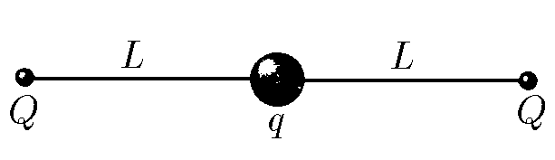

###  Условие:

$3.2.11.$ Найдите частоту малых колебаний системы, описанной в задаче [3.1.10](/ru/3.1.10).

###  Решение:

Второй закон Ньютона

$$
m\ddot{x}(t)-F=0
$$

Где суммарную внешнюю силу найдём из закона Кулона

$$
F=kqQ\left(\frac{1}{(L-x)^2}-\frac{1}{(L+x)^2}\right)
$$

Используясь приближением для малого значения

$$
x =\frac{h}{R} \ll 1; \quad(1+x)^\alpha\approx 1+\alpha x
$$

$$
F=-\frac{4kqQLx}{(L^2-x^2)^2}\approx-\frac{4kqQx}{L^3}
$$

Уравнение гармонических колебаний

$$
\ddot{x}(t)+\frac{4kqQx}{mL^3}x(t)
$$

Получаем искомую частоту малых колебаний

$$
\boxed{\omega =\sqrt{\frac{4kqQ}{mL^3}}=\sqrt{\frac{qQ}{m\pi\varepsilon_0L^3}}}
$$

###  Альтернативное решение:

###  Ответ: $\omega =\sqrt{\frac{qQ}{m\pi\varepsilon_0L^3}}$.