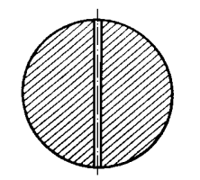

###  Условие

$3.2.12.$ Определите время полета камня от одного полюса Земли до другого по прямому тоннелю, прорытому через центр. Плотность Земли считать постоянной, ее радиус — равным $6400 \mathrm{~}км$.

### Решение

На тело, на расстоянии $x$ от ядра, будет действовать гравитационная сила притяжения вызванная внутренними слоями планеты плотности $\rho$, образующих шар радиуса $x$. Масса этой части земли

$$
M_\oplus = \frac{4}{3} \rho\pi x^3
$$

Гравитационная сила, дествующая на камень на глубине $x$

$$
F_G = \frac{GmM_\oplus}{x^2}=mg\frac{x}{R}
$$

Второй закон Ньютона

$$
m\ddot{x}(t)=-\frac{mg}{R}x(t)
$$

Запишем уравнение гармонических колебаний

$$
\ddot{x}(t)+\frac{g}{R}x(t)=0
$$

Угловая частота таких колебаний

$$
\omega =\sqrt{\frac{g}{R}}\Rightarrow T=2\pi\sqrt{\frac{R}{g}}
$$

Т.к. нас интересует время полёта только в одну сторону, поэтому берём половину этого периода

$$
\boxed{t=\frac{T}{2}=\pi\sqrt{\frac{R}{g}}=42\text{ min}}
$$

#### Ответ

$$
t=42\text{ min}
$$