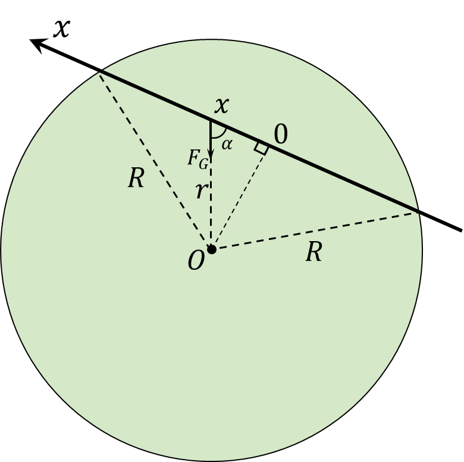

###  Условие

$3.2.13.$ В Земле прорыт прямой тоннель, не проходящий через ее центр. Определите время движения поезда с выключенными двигателями по такому тоннелю, если влиянием вращения Земли на движение поезда и трением пренебречь.

### Решение

Аналогично [3.2.12](../3.2.12), внешнюю силу $F$ найдём как

На тело, на расстоянии $x$ от ядра, будет действовать гравитационная сила притяжения вызванная внутренними слоями планеты плотности $\rho$, образующих шар радиуса $x$. Масса этой части земли

$$
M_\oplus = \frac{4}{3} \rho\pi x^3
$$

Гравитационная сила, дествующая на камень на глубине $x$

$$
F_G = \frac{GmM_\oplus}{x^2}=mg\frac{x}{R}
$$

При этом только горизонтальная компонента этой силы будет создавать момент. Откуда, результирующая внешняя сила равна

$$
F=mg\cos\alpha =mg\frac{x}{R}
$$

Отсюда находим угловую частоту колебаний

$$
\omega =\sqrt{\frac{g}{R}}
$$

Период колебаний в данной системе

$$
T=2\pi\sqrt{\frac{R}{g}}
$$

Т.к. нас интересует время полёта только в одну сторону, поэтому берём половину этого периода

$$
\boxed{t=\frac{T}{2}=\pi\sqrt{\frac{R}{g}}\approx42\text{ min}}
$$

#### Ответ

$$
t=42\text{ min}
$$