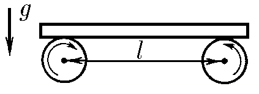

###  Условие 

$3.2.14.$ Доска массы $m$ лежит на двух катках, вращающихся с большой скоростью навстречу друг другу. Расстояние между осями катков $L$, коэффициент трения при скольжении доски по катку $\mu$. Найдите частоту продольных колебаний доски. 

### Решение

  Силы действующие на доску 

Второй закон Ньютона для горизонатальной оси $$ma=F_{fr1}-F_{fr2}$$ Условие равновесия для вертикальной оси $$mg=N_1+N_2\quad(1)$$ В условии равновесия, сумма момента внешних сил, должна быть равна нулю $$N_1\left(\frac{l}{2}-x\right)-N_2\left(\frac{l}{2}+x\right)=0$$ Откуда сила реакции на вторую опору $$N_2=N_1\left(\frac{L/2-x}{L/2+x}\right)$$ Подставляем в $(1)$ $$mg=N_1\left(1+\frac{L/2-x}{L/2+x}\right)$$ $$N_1=mg\left(\frac{L/2+x}{L}\right);\quad N_2=mg\left(\frac{L/2-x}{L}\right)$$ Второй закон Ньютона для горизонтальной оси $$m\ddot{x}=\mu N_2-\mu N_1= - \mu mg \frac{2x}{L}\quad(2)$$ Преобразуем полученное выражением и получаем уравнение гармонических колебаний $$\ddot{x}(t)+\frac{2\mu g}{l}x(t)=0$$ Откуда угловая частота колебаний $$\boxed{\omega =\sqrt{\frac{2\mu g}{l}}}$$ 

#### Ответ

$$\omega =\sqrt{\frac{2\mu g}{l}}$$ 
