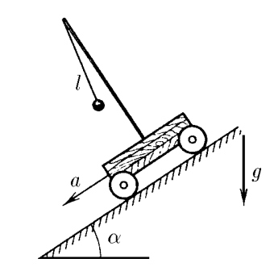
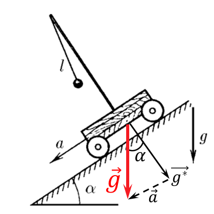

###  Условие 

$3.2.16.$ Тяжелая тележка скатывается с ускорением $a$ по наклонной плоскости, образующей угол $\alpha$ с горизонтом. Найдите период колебаний маятника длины $l$, установленного на тележке. 

### Решение

Период колебаний маятника на наклонной тележке, можно найти по известной формуле для периода колебания математического маятника, перейдя в инерциальную систему отсчёта тележки $$T=2\pi\sqrt{\frac{l}{g^*}}\quad(1)$$ Где $\vec{g}^*$ ускорение инерциональной системы отчёта $$\vec{g}^*=\vec{g}-\vec{a}$$ По теореме косинусов, найдём значение модуля вектора $\vec{g}^*$ $$(g^{*})^2=a^2+g^2-2ag\cos\alpha$$ Откуда $$\boxed{g^*=\sqrt{a^2+g^2-2ag\cos\alpha}}$$ Подставляем в выражение $(1)$ и находим период колебаний маятника $$\boxed{T=2\pi\sqrt{\frac{l}{\sqrt{a^2+g^2-2ag\cos\alpha}}}}$$ 

#### Ответ

$$T=2\pi\sqrt{l/{\sqrt{a^2+g^2-2ag\cos\alpha}}}$$ 
