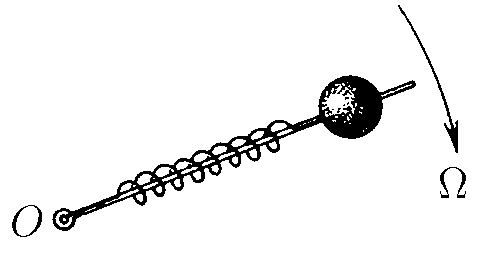
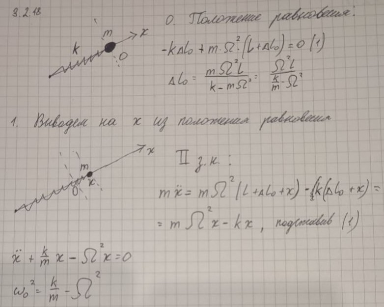

###  Условие: 

$3.2.18.$ Шарик массы $m$, насаженный на стержень, вращается с угловой скоростью $\Omega$ вокруг оси O, с которой он соединен пружиной жесткости k. Определите частоту колебаний шарика вдоль пружины, если $\Omega^2 < k/m$. 

###  Решение: 

Суммируя силы, запишем уравнение движения шарика:

$$m\ddot{x}(t)+kx-m\Omega^2x=0$$  

Упростим уравнение, разделив на массу $m$:

$$\ddot{x}(t)+(\frac{k}{m}-\Omega^2)x(t)=0$$  
  
Это дифференциальное уравнение гармонических колебаний с цикловой частотой колебаний:

$$\omega =\sqrt{\frac{k}{m}-\Omega^2}$$  

###  Альтернативное решение: 

 

####  Ответ: $\omega =\sqrt{\frac{k}{m}-\Omega^2}$. 
