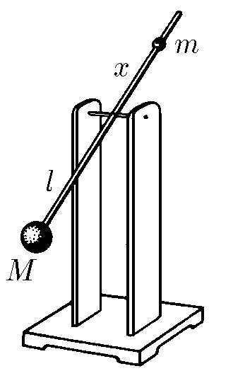
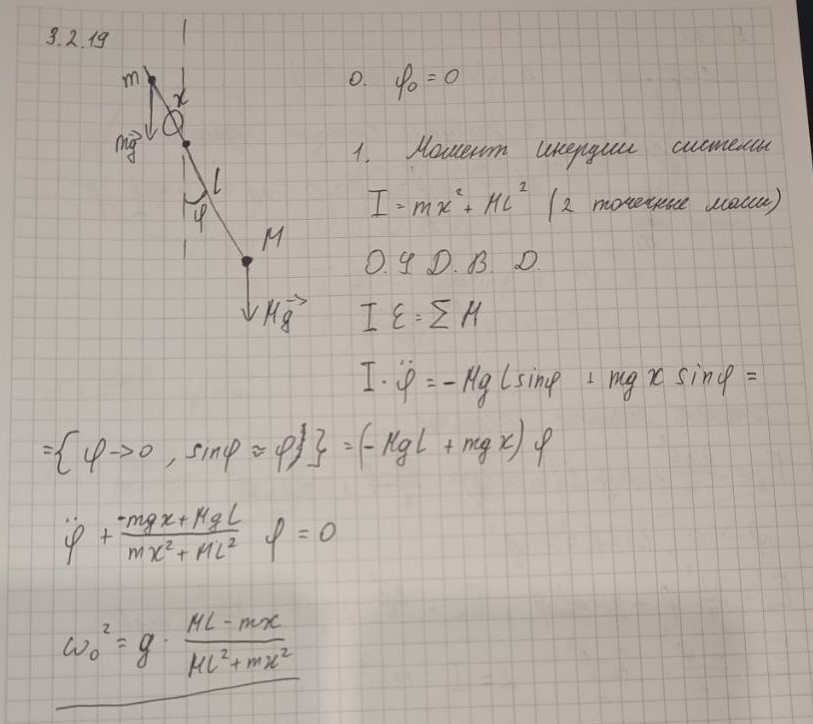

### Условие: 

$3.2.19.$ Метроном представляет собой легкий стержень, на нижнем конце которого на расстоянии $l$ от оси находится груз массы $M$. Выше оси подвижный грузик массы $m$ можно закреплять на стержне на разных расстояниях $x$ от оси, тем самым подбирая нужную частоту колебаний метронома. Считая массы точечными, найдите, как частота колебаний зависит от расстояния $x$. 

 

### Решение: 

При малых отклонениях угол \(\varphi\) небольшой (\(\sin\varphi \approx \varphi\)). На метроном действуют два момента:
   - Момент силы тяжести груза \(M\): \(Mgl\sin\varphi \approx Mgl\varphi\),
   - Момент силы тяжести груза \(m\): \(mgx\sin\varphi \approx mgx\varphi\).

Результирующий момент:

$$I\varepsilon =\sum_{}^{}M\approx\varphi(mgx-Mgl)$$

По-теореме Штейнера, для стержня с двумя точечными грузами момент инерции относительно оси:

$$I=Ml^2+mx^2$$

Уравнение динамики вращательного движения:

$$(Ml^2+mx^2)\ddot{\varphi}+\varphi(Mgl-mgx)=0$$

Дифференциальное уравнение колебаний принимает вид:

$$\ddot{\varphi}+\frac{Mgl-mgx}{Ml^2+mx^2}\varphi=0$$

Частота колебаний $\omega$:

$$\omega =\sqrt{\frac{g(Ml-mx)}{Ml^2+mx^2}}$$

### Альтернативное решение: 

 

#### Ответ: $\omega =\sqrt{\frac{g(Ml-mx)}{Ml^2+mx^2}}$. 
