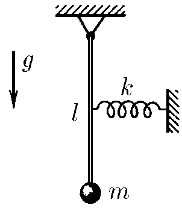
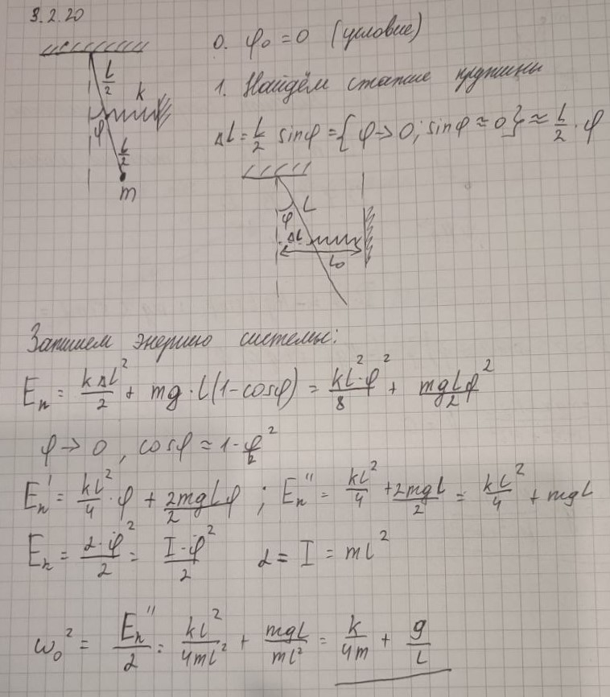

###  Условие: 

$3.2.20.$ Как изменится частота колебаний маятника, представляющего собой груз на легком стержне, если к середине стержня прикрепить горизонтальную пружину жесткости $k$? На рисунке изображено состояние равновесия. 

 

###  Решение: 

Частота \( \omega \) связана с параметрами системы уравнением:

$$\omega =\sqrt{\frac{\alpha}{\beta}}$$

где \( \alpha \) — коэффициент, связанный с потенциальной энергией, а \( \beta \) — коэффициент, связанный с кинетической энергией.

Кинетическая энергия колеблющейся массы записывается как:

$$E_k=\frac{m\upsilon^2}{2}\Rightarrow \beta = 1$$  

Потенциальная энергия \( E_p \) складывается из двух частей:

1. Энергия, связанная с маятником (\( E_p^{(1)} \)):
   \[
   E_p^{(1)} = mgl(1 - \cos\varphi).
   \]
   При малых углах \( \varphi \) справедливо приближение \( \cos\varphi \approx 1 - \frac{\varphi^2}{2} \), поэтому:
   \[
   E_p^{(1)} \approx \frac{1}{2} mgl \varphi^2.
   \]

2. Энергия, связанная с растяжением пружины (\( E_p^{(2)} \)):
   Если маятник отклоняется на угол \( \varphi \), горизонтальное смещение точки крепления пружины к середине стержня составляет \( x = \frac{l}{2} \varphi \). Потенциальная энергия пружины:
   \[
   E_p^{(2)} = \frac{1}{2} k \left(\frac{x}{2}\right)^2 = \frac{1}{2} k \left(\frac{l \varphi}{2}\right)^2.
   \]
   
Суммарная потенциальная энергия:

\[
E_p = E_p^{(1)} + E_p^{(2)} = \frac{1}{2} mgl \varphi^2 + \frac{1}{8} k l^2 \varphi^2.
\]

Сравнивая \( E_p \) с выражением \( E_p = \frac{\alpha}{2} \varphi^2 \), получаем:
\[
\alpha = \frac{g}{l} + \frac{k}{4m}.
\]

Подставляем \( \alpha \) и \( \beta \) в формулу для частоты:

\[
\omega^2 = \frac{g}{l} + \frac{k}{4m}.
\]

###  Альтернативное решение: 

 

####  Ответ: $\omega^2=\frac{g}{l}+\frac{k}{4m}$. 
