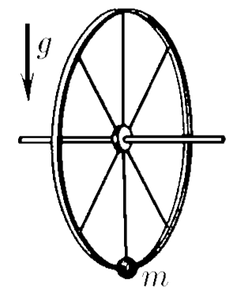
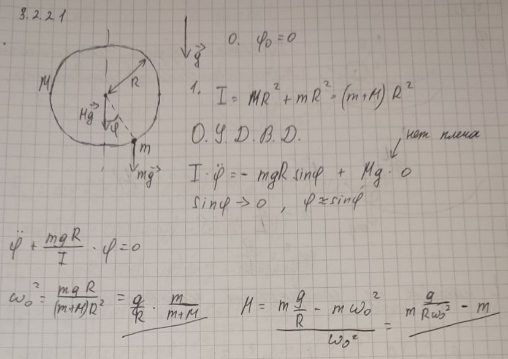

###  Условие: 

$3.2.21.$ К ободу колеса с горизонтально расположенной осью прикрепили грузик массы $m$. Найдите массу колеса, предполагая ее однородно распределенной по ободу, если частота колебаний колеса с грузиком вокруг оси равна $\omega$, а его радиус равен $R$, $R< g/\omega^2$ . 

 

###  Решение: 

$I\varepsilon =\sum_{}^{}M$  
  
$I=MR^2+mR^2=R^2(M+m)$  
  
$R^2(M+m)\ddot{\varphi}+mgR\sin\varphi=0$  
  
$\ddot{\varphi}+\frac{mg}{R(M+m)}\varphi=0$  
  
$\omega^2=\frac{mg}{R(M+m)}\Rightarrow M=m(\frac{g}{\omega^2R}-1)$  
  

###  Альтернативное решение: 

 

###  Ответ: $M=m(\frac{g}{\omega^2R}-1)$. 

### 
