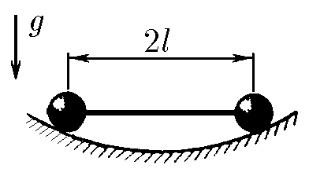
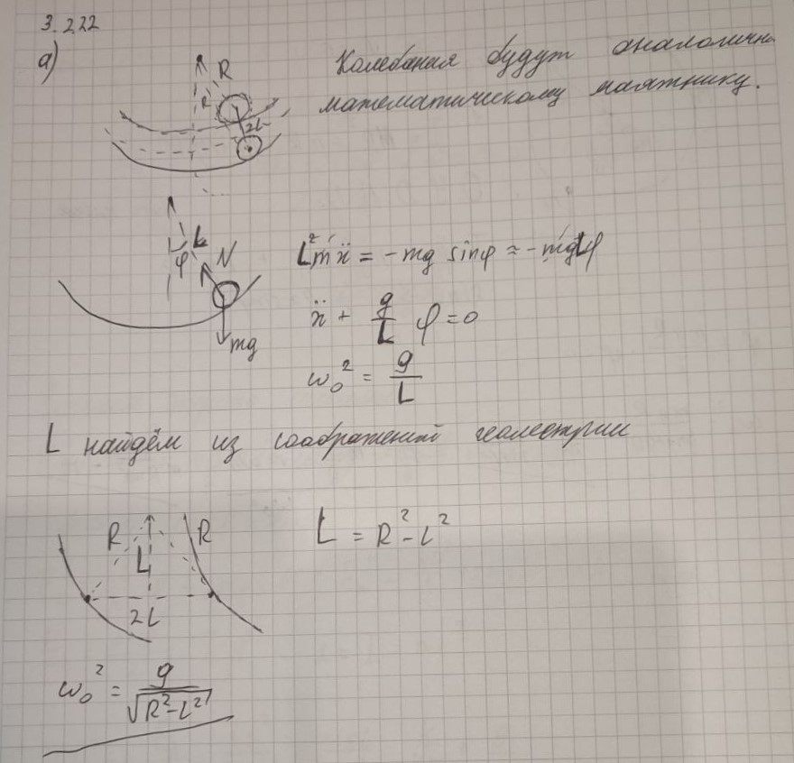
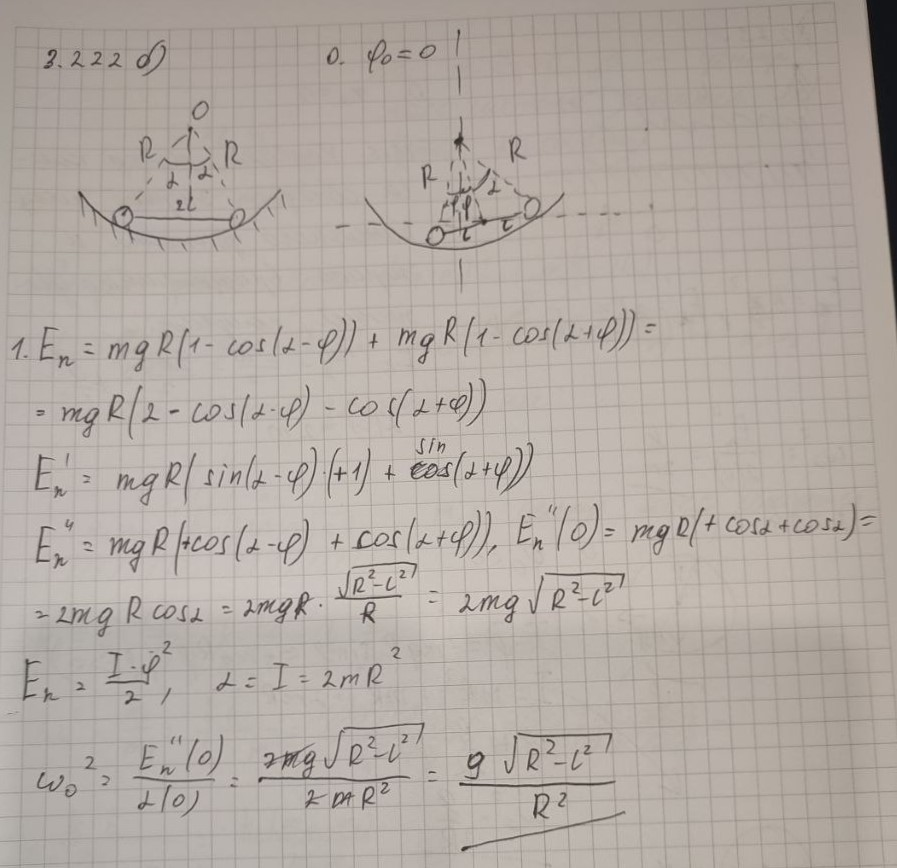

###  Условие: 

$3.2.22.$ В сферической лунке радиуса $R$ находятся две точечные массы, соединенные невесомым стержнем длины $2l$. Определите частоту колебаний при движении в направлении: а) перпендикулярном плоскости рисунка; $б^ ∗$ ) параллельном этой плоскости. 

 

###  Решение: 

а) $2m\ddot{x}(t)+2mg\sin\varphi=0$  
  
$\ddot{x}(t)+\frac{g}{\sqrt{R^2-l^2}}x(t)=0$  
  
$\omega^2=\fbox{$\frac{g}{\sqrt{R^2-l^2}}$}$  
  
б) $\omega^2=\frac{\alpha}{\beta}$  
  
$E_p=2mgR'(1-\cos\varphi)$$=2mg\sqrt{R^2-l^2}(1-\cos\varphi)$$\approx \frac{2mg\sqrt{R^2-l^2}}{2}\varphi^2$  
  
$\alpha =\frac{2mg\sqrt{R^2-l^2}}{2}$  
  
$E_k=\frac{2m\upsilon^2}{2}=\frac{2m\omega^2R^2}{2}=\frac{2mR^2}{2}\dot{\varphi}^2$  
  
$\beta =\frac{2mR^2}{2}$  
  
$\omega^2=\fbox{$\frac{g\sqrt{R^2-l^2}}{R^2}$}$  
  

###  Альтернативное решение: 

 

 

###  Ответ: $\omega^2=\frac{g}{\sqrt{R^2-l^2}}$, $\omega^2=\frac{g\sqrt{R^2-l^2}}{R^2}$. 

### 
