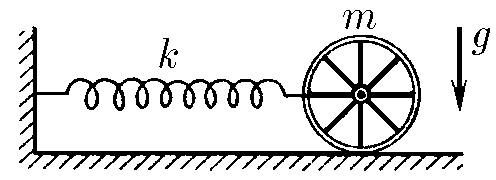
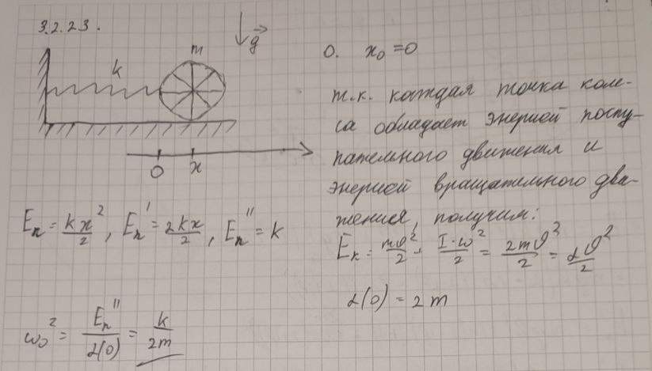

###  Условие:

$3.2.23.$ Пружина жесткости $k$ одним концом присоединена к оси колеса массы $m$, которое способно катиться без проскальзывания, а другим прикреплена к стенке. Какова частота колебаний системы? Масса колеса однородно распределена по ободу.

###  Решение:

$\omega =\sqrt{\frac{\alpha}{\beta}}$

$E_p=\frac{kx^2}{2}\Rightarrow \alpha =\frac{k}{2}$

$E_k=\frac{m\upsilon^2}{2}+\frac{I\omega^2}{2}=\frac{2m\upsilon^2}{2}\Rightarrow \beta =\frac{2m}{2}$

$\omega =\fbox{$\sqrt{\frac{k}{2m}}$}$

###  Альтернативное решение:

#### Ответ: $\omega =\sqrt{\frac{k}{2m}}$.