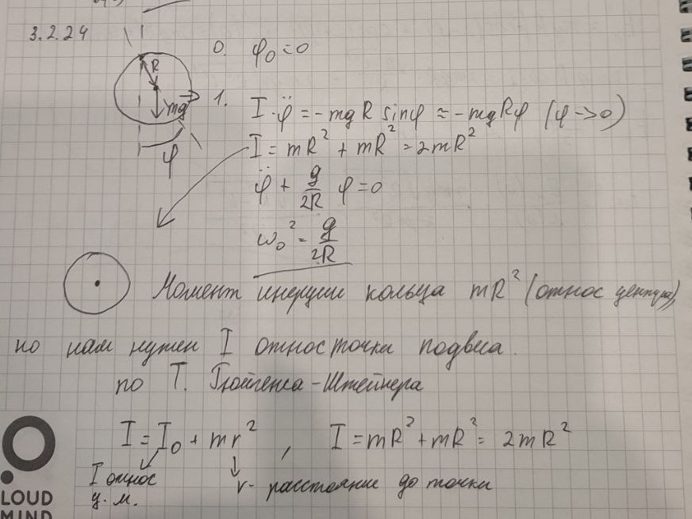

###  Условие:

$3.2.24.$ Найдите частоту колебаний тонкого обруча радиуса $R$, подвешенного на гвозде. Проскальзывания нет; колебания происходят в плоскости обруча.

###  Решение:

$I=mR^2+md^2$, где $d$ - расстояние от прошлой оси до нынешней: $I=mR^2+mR^2=2mR^2$

$L=\frac{2mR^2}{mR}=2R$

$T=2\pi\sqrt{\frac{L}{g}}=2\pi\sqrt{\frac{2R}{g}}$

$\omega =\sqrt{\frac{g}{2R}}$

###  Альтернативное решение:

###  Ответ: $\omega =\sqrt{\frac{g}{2R}}$.