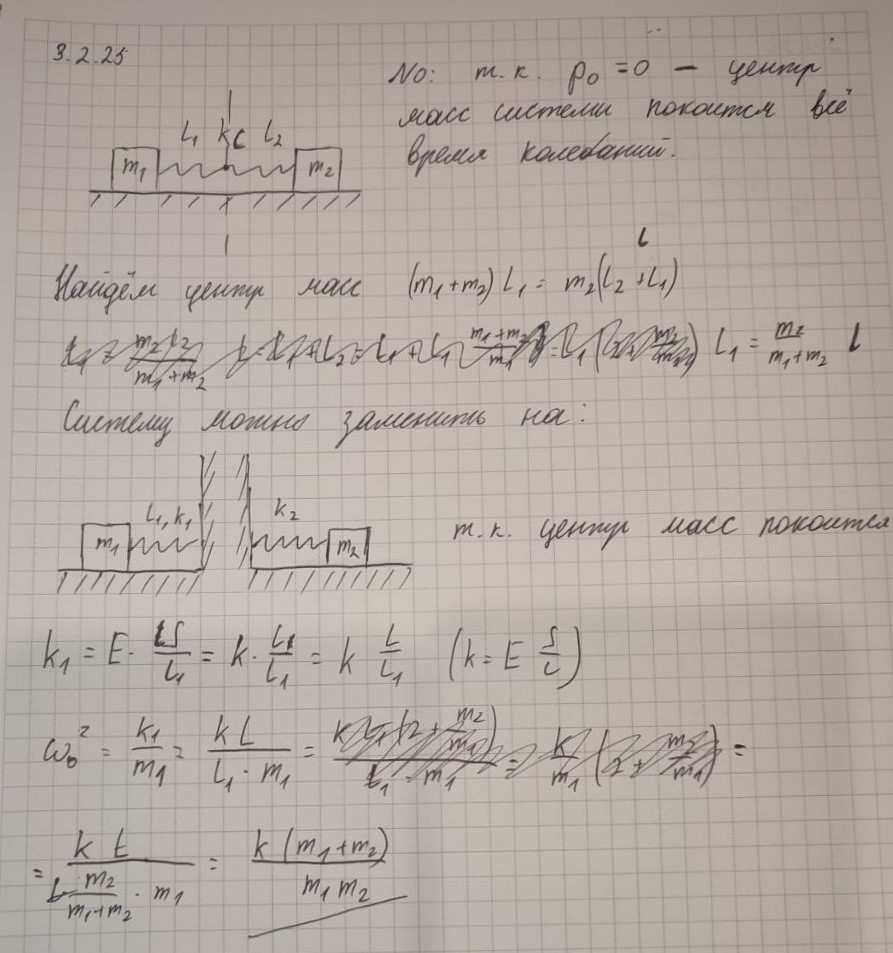

###  Условие:

$3.2.25.$ Два тела массы $m_1$ и $m_2$ связаны пружиной жесткости $k$. Какова частота свободных колебаний такой системы, если вращения нет?

###  Решение:

$m_1x_c=m_2(l-x_c)\Rightarrow x_c=\frac{m_2l}{m_1+m_2}$

$k_1x_c=k_2(l-x_c)$

$\frac{k_1m_2l}{m_1+m_2}=k_2(l-\frac{m_2l}{m_1+m_2})=\frac{k_2m_1l}{m_1+m_2}$

$\frac{k_1}{k_2}=\frac{m_1}{m_2}$

$k=\frac{k_1k_2}{k_1+k_2}=\frac{k_1\frac{m_2}{m_1}}{k_1+k_1\frac{m_2}{m_1}}=\frac{k_1m_2}{m_1+m_2}$

$\omega =\sqrt{\frac{k_1}{m_1}}=\sqrt{\frac{k_2}{m_2}}=\sqrt{\frac{k(m_1+m_2)}{m_1m_2}}$

###  Альтернативное решение:

###  Ответ: $\omega =\sqrt{\frac{k(m_1+m_2)}{m_1m_2}}$.