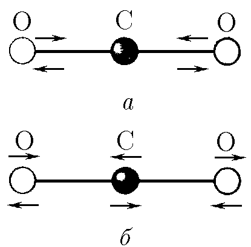

###  Условие:

$3.2.27^*.$ Возможны два типа линейных колебаний молекулы углекислого газа: а) ядра кислорода движутся в противоположные стороны, а ядро углерода остается на месте; б) ядра кислорода движутся с одинаковыми скоростями в направлении, противоположном направлению движения ядра углерода. Определите отношение частот этих колебаний.

###  Решение:

Обозначим жесткость пружинок модели молекулы $k$, массу шариков - атомов кислорода $M$ и массу шарика - атома углерода $m$ ($m/M = 12/16$).

Совершая колебания типа а), оба атома кислорода колеблются синхронно относительно неподвижного атома углерода. Эго связано с тем, что в силу симметрии колебании атомов кислорода на атом углерода в любой момент действуют с обеих сторон равные по абсолютной величине и противоположно направленные силы, которые "уравновешивают" друг друга. Поэтому в случае а) атомы кислорода совершают свободные колебания, период которых равен

$$
T_{a} = 2 \pi\sqrt{ \frac{M}{k} }
$$

При колебаниях типа б) на атом углерода действуют равные по абсолютной величине силы, по направлены они в одну к ту же сторону. Если шарик - атом углерода разбить на две равные части, то ясно, что они будут колебаться как одно целое: на них всегда действуют равные силы и, следовательно, шарики-половинки и любой момент будут иметь одинаковые ускорения, скорости и координаты. Частота колебаний молекулы $CO_{2}$, равна чистоте колебаний системы, состоящей из атома кислорода и половины атома углерода. Таким образом, задача сводится к определению периода колебании соединенных пружинкой шариков массы $M$ и $m/2$. Такие шарики колеблются около неподвижного центра масс системы. Если длина пружинки в нерастянутом состоянии равна $l$, то центр масс системы находится на расстоянии $l \frac{m}{m + 2M}$ от шарика массы $M$. Поэтому можно считать, что шарик массы $M$ (атом кислорода) колеблется относительно центра масс на пружинке длины

$$
l_{1} = l \frac{m}{m + 2M}
$$

Жесткость части пружинки больше жесткости целой пружинки. Так как жесткость обратно пропорциональна отношению длины этой части к длине целой пружины, то жесткость части пружинки

$$
k_{1} = k \frac{l}{l_{1} } = k \frac{m + 2M}{m}
$$

Период колебаний шарика массы $M$ на пружинке жесткости $k_{1}$ равен

$$
T_{б} = 2 \pi\sqrt{ \frac{M}{k_{1} } } = 2 \pi\sqrt{ \frac{mM}{k(m _ 2M) } }
$$

$$
\frac{T_{б} }{T_{а} } = \sqrt{ \frac{m + 2M}{m} } = \sqrt{ 1 + \frac{2M}{m} }
$$

Так как $\frac{M}{m} = \frac{16}{12} = \frac{4}{3}$, то:

$$
\frac{T_{б} }{T_{а} } = \sqrt{ 1 + \frac{8}{3} } = \sqrt{ \frac{11}{3} }
$$

Следовательно, отношение частот:

$$
\frac{ \nu_{б} }{ \nu_{а} } = \sqrt{ \frac{3}{11} }
$$

####  Ответ: $\frac{ \nu_{б} }{ \nu_{а} } = \sqrt{ \frac{3}{11} }$.