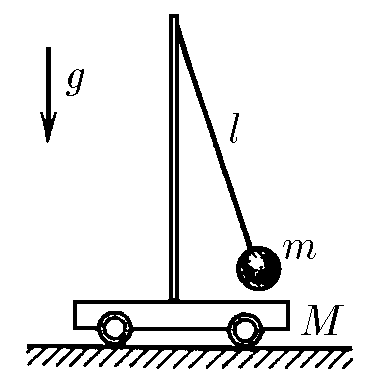
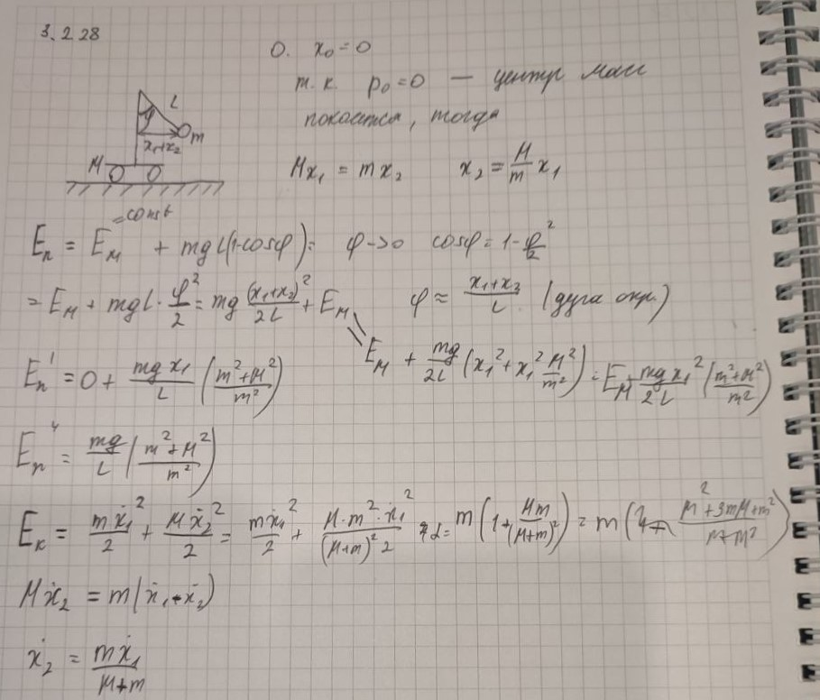

###  Условие:

$3.2.28.$ На гладкой горизонтальной поверхности находится тележка массы $M$ с установленным на ней математическим маятником длины $l$ и массы $m$. Найдите период колебаний системы.

###  Решение:

$T=2\pi\sqrt{\frac{\beta}{\alpha}}$

$E_k=\frac{m\upsilon^2}{2}+\frac{MU^2}{2}$

$m\upsilon =MU\Rightarrow U=\frac{m\upsilon}{M}$

$E_k=\frac{m\upsilon^2}{2}+\frac{m^2\upsilon^2}{2M}=\frac{m}{2}(1+\frac{m}{M})\upsilon^2$

$\beta =\fbox{$\frac{m}{2}(1+\frac{m}{M})$}$

$E_p=mgl(1-\cos\varphi)\approx mgl\frac{\varphi^2}{2}=\frac{mg}{2l}x^2$

$\alpha =\fbox{$\frac{mg}{2l}$}$

$T=2\pi\sqrt{\frac{l(m+M)}{Mg}}$

###  Альтернативное решение:

#### Ответ: $T=2\pi\sqrt{\frac{l(m+M)}{Mg}}$.