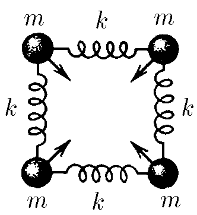
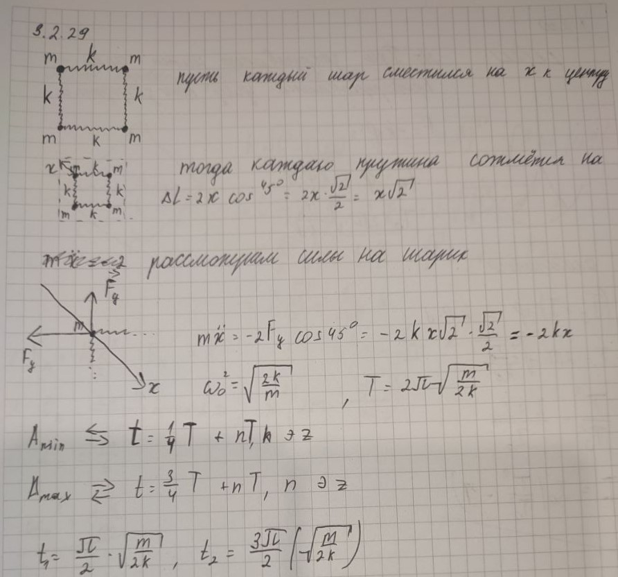

###  Условие:

$3.2.29.$ Четыре одинаковых шарика массы $m$ каждый, соединенные одинаковыми пружинами жесткости $k$, образуют квадрат. Одновременно всем четырем шарикам сообщили одинаковые по модулю скорости, направленные к центру квадрата. Через какое время после этого пружины будут: а) сильнее всего сжаты; б) сильнее всего растянуты?

###  Решение:

Данную систему можно рассматривать как колебания четырех маятников на пружинах жесткости по $2k$ каждая. Жесткость пружин увеличивается, т.к. шарики колеблются относительно центров масс каждой системы, состоящей из двух шариков и пружины (центром масс данной системы является центр пружины) $T=2\pi\sqrt{\frac{m}{k^*}}=2\pi\sqrt{\frac{m}{2k}}$

а) $t_1=\frac{T}{4}=\frac{\pi}{2}\sqrt{\frac{m}{2k}}$

б) $t_2=\frac{3}{4}T=\frac{3}{2}\pi\sqrt{\frac{m}{2k}}$

###  Альтернативное решение:

#### Ответ: $t_1=\frac{\pi}{2}\sqrt{\frac{m}{2k}}$, $t_2=\frac{3}{2}\pi\sqrt{\frac{m}{2k}}$.