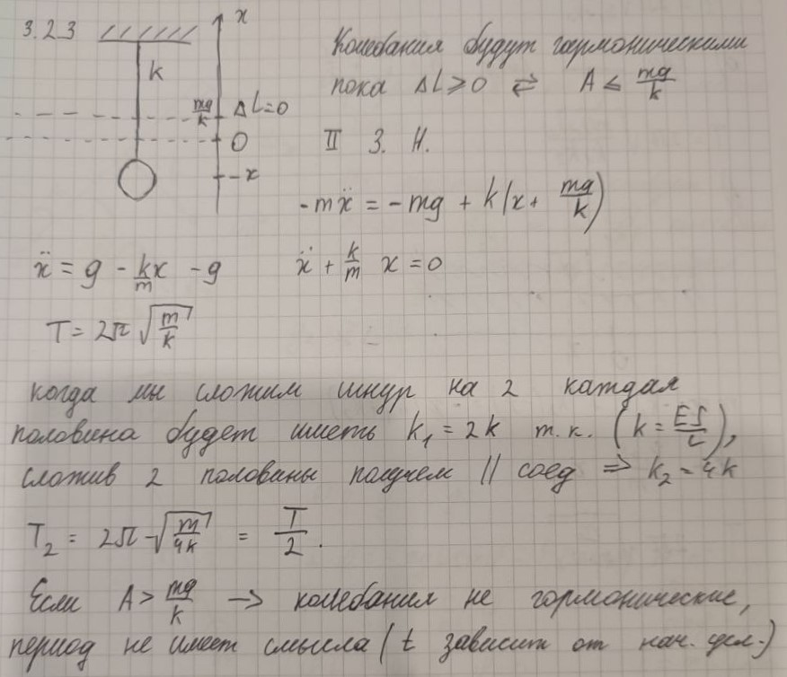

###  Условие

$3.2.3.$ Груз колеблется по вертикали на резиновом шнуре. Во сколько раз изменится период вертикальных колебаний груза, если его подвесить на том же шнуре, сложенном вдвое?

### Решение

Период колебаний на стандартном шнуре найдём как период колебаний пружинного маятника

$$
T_1=2\pi\sqrt{\frac{m}{k}}
$$

Когда мы складываем шнур, мы изменяем его длину и ширину и, соответсвенно, меняет его жесткость $k'$

$$
T_2=2\pi\sqrt{\frac{m}{k'}}
$$

Так как пружина разделяется надвое и длина каждой половинки равна $l/2$ и жесткость каждой из них $k_1=2k$; сложив две половинки параллельно получаем параллельное соединение

$$
k'=2k_1=4k
$$

Подставляем в выражение для $T_2$ периода колебания "нового" шнура

$$
T_2=2\pi\sqrt{\frac{m}{4k}}=\pi\sqrt{\frac{m}{k}}
$$

Откуда получаем, отношение периодов колебаний

$$
\boxed{\frac{T_1}{T_2}=2}
$$

###  Альтернативное решение:

#### Ответ

Период уменьшится вдвое