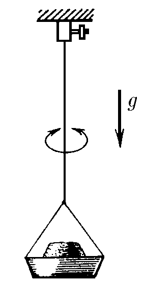
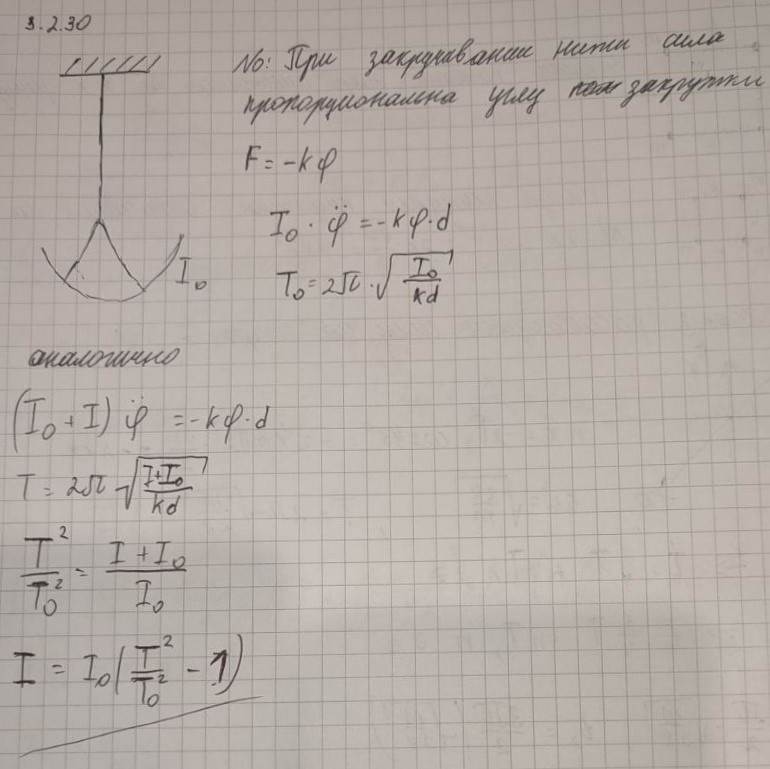

###  Условие: 

$3.2.30.$ Момент инерции чашки, подвешенной на проволоке, относительно оси кручения этой проволоки, равен $I_0$. Период крутильных колебаний системы равен $T_0$. На чашку положили груз. При этом период крутильных колебаний изменился и стал равным $T$. Каков момент инерции груза относительно той же оси кручения? Момент сил, возникающих при закручивании проволоки, пропорционален углу закручивания 

 

###  Решение: 

 

###  Ответ: $I = I_0[(T /T_0)^2 − 1]$. 

### 
