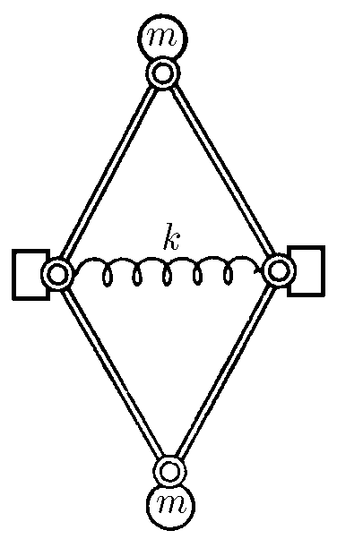
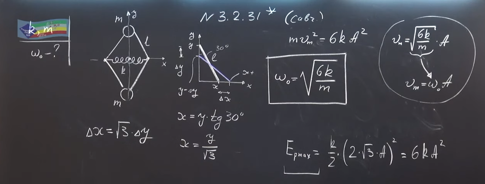
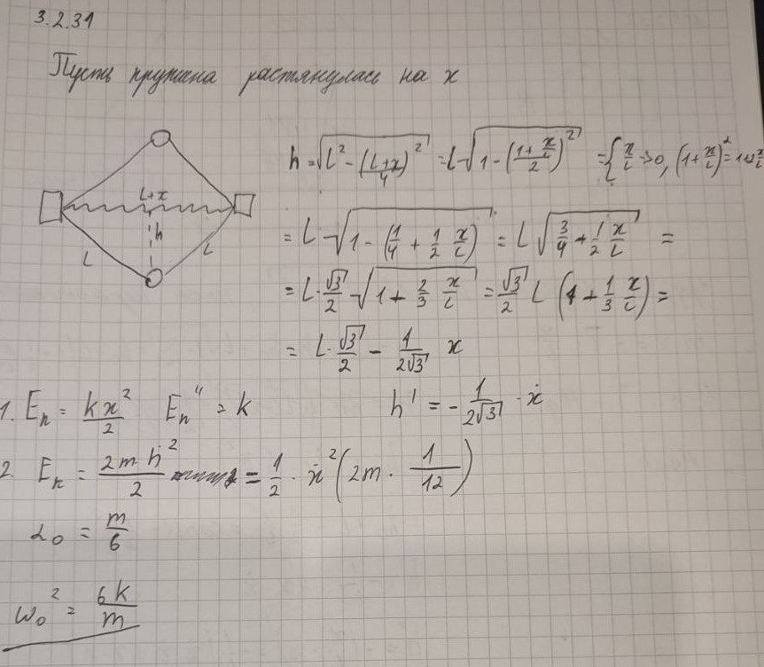

###  Условие: 

$3.2.31^*.$ Легкие стержни соединены шарнирами в виде ромба. Две противоположные вершины ромба связаны пружиной жесткости $k$, а к двум другим вершинам прикреплены шарики одинаковой массы $m$. Найдите частоту колебаний системы, если длина пружины в недеформированном состоянии совпадает с длиной стержня. 

 

###  Решение: 

 

 

###  Альтернативное решение: 

 

###  Ответ: $\omega = \sqrt{6k/m}$ 

### 
