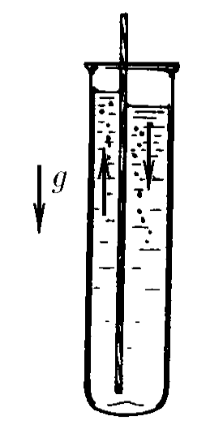

###  Условие:

$3.2.34.$ Вертикальная перегородка в высоком сосуде разделяет его на две сообщающиеся части с разными сечениями. Найдите период малых колебаний жидкости, считая, что свободная поверхность ее в каждой части сосуда остается горизонтальной. Глубина жидкости в состоянии равновесия равна $H$.

###  Решение:

$T=2\pi\sqrt{\frac{\beta}{\alpha}}$

$E_k=\frac{m(\dot{x})^2}{2}+\frac{M(\dot{x}')^2}{2}$

$S_1x=S_2x'\Rightarrow x'=\frac{S_1x}{S_2}$

$E_k=\frac{\rho HS_1(S_1+S_2)}{2S_2}(\dot{x}^2)$

$\beta =\fbox{$\frac{\rho HS_1(S_1+S_2)}{2S_2}$}$

$E_p=mg\frac{x}{2}+MG\frac{x'}{2}

$$
=\frac{\rho gS_1x^2}{2}+\frac{S_1}{S_2}\rho gS_2\frac{x^2}{2}
$$

=\frac{\rho gS_1(S_1+S_2)}{2S_2}x^2$

$\alpha =\fbox{$\frac{\rho gS_1(S_1+S_2)}{2S_2}$}$

$T=2\pi\sqrt{\frac{H}{g}}$

#### Ответ: $T=2\pi\sqrt{\frac{H}{g}}$.