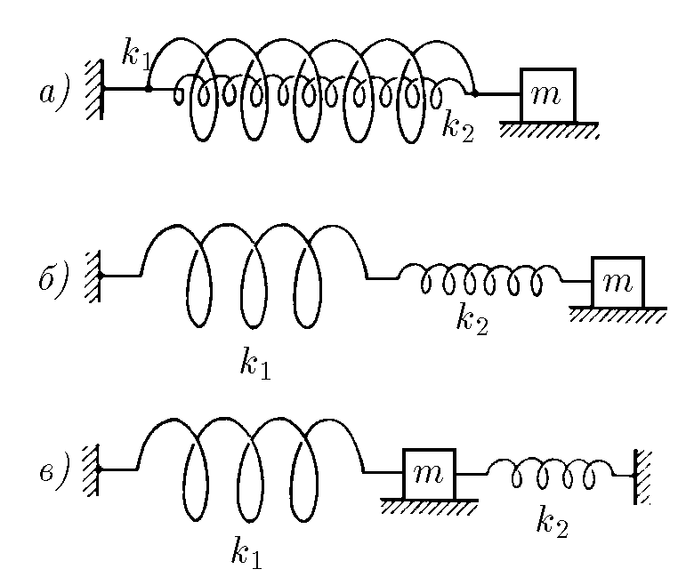
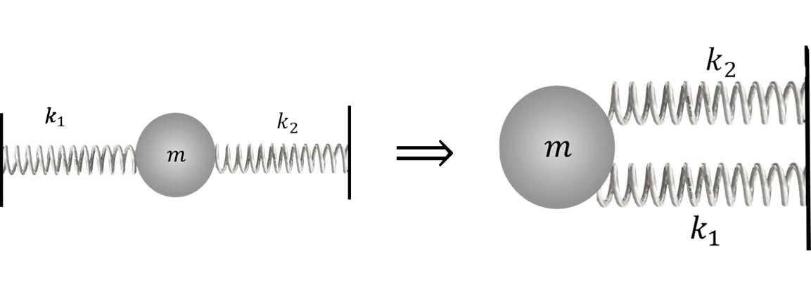
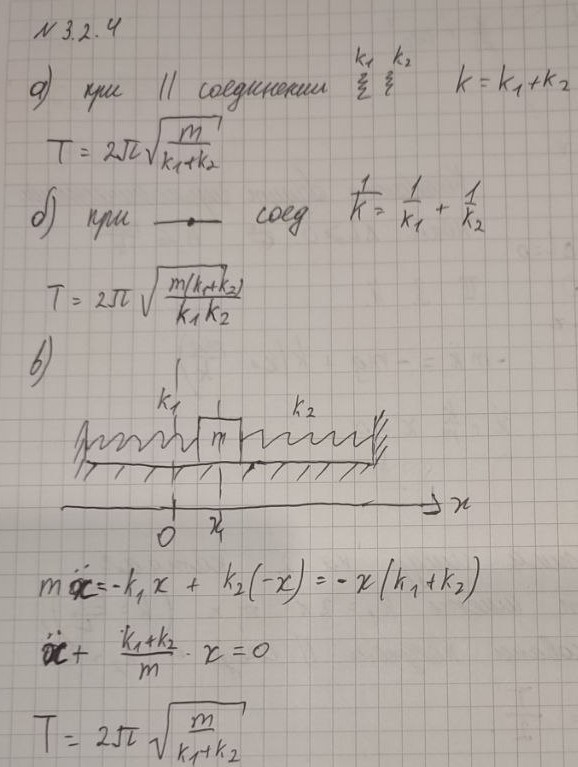

###  Условие 

$3.2.4.$ Найдите период колебаний систем осцилляторов, изображенных на рисунке. Зависит ли период колебаний осциллятора на рисунке в от расстояния между стенками? $k_1$ и $k_2$ — жесткость пружин, $m$ — масса тела. 

### Решение

Период колебания пружинного маятника находится как $$T=2\pi\sqrt{\frac{m}{k}}\quad(1)$$ Далее, будем находить и использовать эквивалентную жесткость для каждой исследуемой системы пружины 

а) На основе результатов из [2.1.15](../../2/2.1.15), мы получили, что при параллельном соединении пружин их эквивалентая жесткость $$k'=k_1+k_2$$ Подставляя в $(1)$: $$T_1=2\pi\sqrt{\frac{m}{k_1+k_2}}$$ б) Альтернативно, из [2.1.16](../../2/2.1.16), мы получили, что при параллельном соединении пружин их эквивалентая жесткость $$k'=\frac{k_1\cdot k_2}{k_1+k_2}$$ Подставляя в $(1)$: $$T_2=2\pi\sqrt{\frac{m(k_1+k_2)}{k_1\cdot k_2}}$$ в) Также в [2.1.16](../../2/2.1.16), мы показали, что данная схема эквивалентна к случаю при параллельном подключении пружин 

  Часть решения из [2.1.16](../../2/2.1.16)

Эквивалентная жесткость пружины $$k'=k_1+k_2$$ Подставляя в $(1)$: $$T_3=2\pi\sqrt{\frac{m}{k_1+k_2}}$$ 

###  Альтернативное решение: 

 

#### Ответ

$$T_1=2\pi\sqrt{\frac{m}{k_1+k_2}}$$ $$T_2=2\pi\sqrt{\frac{m(k_1+k_2)}{k_1k_2}}$$ $$T_3=2\pi\sqrt{\frac{m}{k_1+k_2}}$$ 
