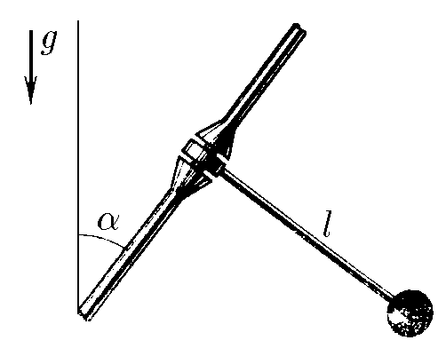

###  Условие 

$3.2.6.$ Маятник представляет собой легкий и жесткий стержень длины $l$ с грузом на конце. Чтобы сделать период колебаний маятника большим без чрезмерного увеличения размеров самого маятника, его ось устанавливают под углом $\alpha$ к вертикали. Определите период колебаний. 

### Решение

 

Разобьём $\vec{g}$ на две компоненты $\vec{g_x}$ и $\vec{g_y}$

При этом только $\vec{g_x}$ создаёт момент силы, т.к. $\vec{g_y}$ пытается выломать его из крепления $$g_x=g\cos\alpha$$ Подставляем ускорение в формулу для периода колебаний математического маятника $$\boxed{T=2\pi\sqrt{\frac{l}{g_x}}=2\pi\sqrt{\frac{l}{g\cos\alpha}}}$$ 

#### Ответ

$$T=2\pi\sqrt{\frac{l}{g\cos\alpha}}$$ 
