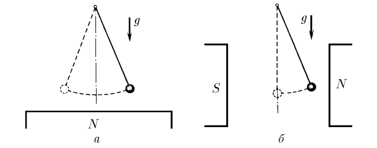

###  Условие 

$3.2.7.$ а. Математический маятник — железный шарик массы $m$, висящий на длинной нити, — имеет период $T_{0}$. В присутствии магнита, расположенного чуть ниже шарика, период колебаний стал равным $T$. Определите действующую на шарик магнитную силу. б. Железный шарик маятника поместили между полюсами магнита так, что на него действует горизонтальная магнитная сила. Найдите эту силу и новое положение равновесия шарика, если период его колебаний после включения магнитного поля стал равным $T$. 

### Решение

а) Период колебаний математического маятника $$T_{0}=2\pi\sqrt{\frac{l}{g}}; \quad T = \frac{2\pi}{\omega}\quad(1)$$ Уравнение гармонических колебаний $$m\ddot{x}=- (mg + F)\sin\varphi = - (mg + F)\frac{x}{l}$$ Откуда угловая частота колебаний $$\omega = \sqrt{\frac{mg+F}{ml}}$$ Из $(1)$ $$\frac{T^{2}}{T_{0}^{2}}=\frac{mg}{mg + F} \Rightarrow \fbox{$F =\frac{mg(T_{0}^{2}-T^{2})}{T^{2}}$}$$ б) Для второго случая запишем уравнение гармонических колебаний $$m\ddot{x}=- \left(\sqrt{(mg)^{2} + F^{2}}\right)\sin\varphi$$ Учитывая приближение значение $\sin\varphi =\frac{x}{l}$ $$m\ddot{x} = - (\sqrt{(mg)^{2} + F^{2}})\frac{x}{l}$$ Решая уравнение гармонических колебаний вида $\ddot{x}+\omega^2x=0$, получаем угловую частоту $$\omega =\sqrt{\frac{\sqrt{(mg)^{2}+F^{2}}}{ml}}$$ Аналогично, подставляя в $(1)$ $$\frac{T_{0}^{4}}{T^{4}} = \frac{(mg)^{2}+ F^{2}}{(mg)^{2}} \Rightarrow \fbox{$F = mg\sqrt{\frac{T_{0}^{4}-T^{4}}{T^{4}}}$}$$ 

###  Альтернативное решение: 

 

#### Ответ

$$F =\frac{mg(T_{0}^{2}-T^{2})}{T^{2}};\quad F = mg\sqrt{\frac{T_{0}^{4}-T^{4}}{T^{4}}}$$ 
