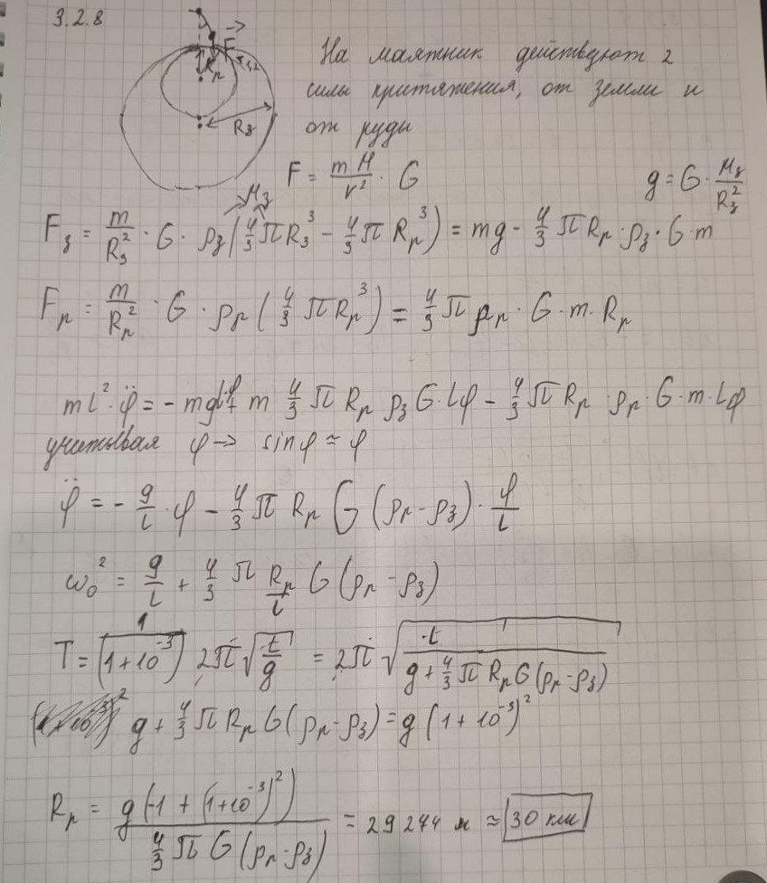

###  Условие 

$3.2.8.$ Вблизи рудного месторождения период колебаний маятника изменился на $0.1$. Плотность руды в месторождении $8\cdot 10^{3}\mathrm{~кг/м^3}$. Оцените размеры месторождения, если средняя плотность Земли $5.6\cdot 10^{3}\mathrm{~кг/м^3}$, а её радиус $6400\mathrm{~км}$. 

### Решение

Запишем, используя закон гравитации, уравнения для определения ускорений свободного падения, с учётом того, что над месторождением ускорение будет больше, нежели вдали от него $$g_{0}=\frac{4}{3}\pi RG\rho_{0}\approx 4\pi RG\rho_{0}$$ $$g=g_{0}+g_{k}\approx g_{0} + 4\pi RG(\rho - \rho_{0})$$ Запишем заданное по условию задачи соотношение периодов колебаний маятника $$\alpha =\frac{T-T_{0}}{T_{0}} = 0,1;\quad\xi = \frac{T}{T_{0}}=1+10^{-3}$$ Отношение периодов выразим через значения ускорения свободного падения $$\xi^{2} = \frac{g_{0}+g}{g_{0}}=1+\frac{r(\rho -\rho_{0})}{R\rho_{0}}$$ $$\boxed{r=\frac{(\xi^{2}-1)R\rho_{0}}{\rho -\rho_{0}}\approx 30\mathrm{~км}}$$ 

###  Альтернативное решение: 

 

#### Ответ: $r\approx30\mathrm{~км}$
