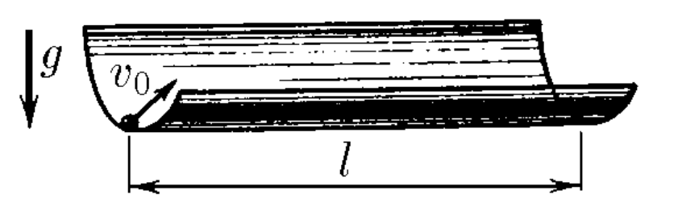

###  Условие:

$3.3.10.$ Из нижней точки гладкого горизонтального цилиндрического желоба радиуса $R$ под небольшим углом к его образующей выскальзывает со скоростью $v_0$ маленький шарик. Сколько раз на длине $l$ он пересечет нижнюю образующую желоба?

###  Решение:

#### Ответ:

Число пересечений равно целой части величины

$$
\frac{l}{\pi v_0} \sqrt{\frac{g}{R}}
$$