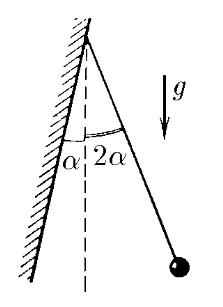
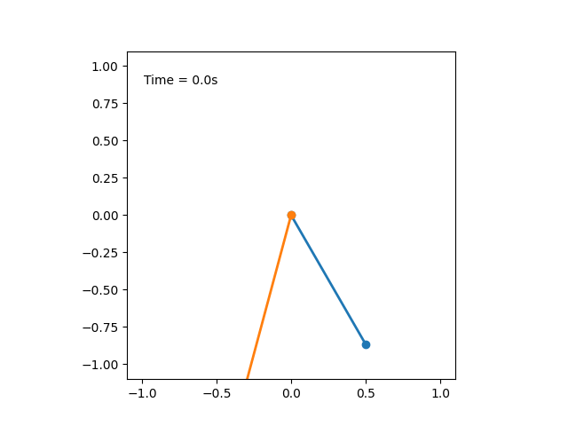

###  Условие:

$3.3.11.$ К наклонной стене подвешен маятник длины $l$. Маятник отклонили от вертикали на малый угол, в два раза превышающий угол наклона стены к вертикали, и отпустили. Найдите период колебаний маятника, если удары о стену абсолютно упругие.

###  Решение:

Ниже представлена анимация движения маятника, описанного в условии задачи

Перед просмотр решения рекомендую посмотреть решение аналогичной задачи [3.3.5](../3.3.5)

Угол поворота нити математического маятника описывается как

$$
\varphi(t) = \varphi_0 \cos\omega t
$$

В данном случае максимальный угол отклонения составляет

$$
\varphi_0 = 2\alpha
$$

Время за которое тело могло бы поднимяться от угла $\alpha$ до $2\alpha$ описывается уравнением

$$
\cos\omega t = \frac{1}{2}
$$

$$
\omega t = \frac{\pi}{3}
$$

$$
t = \frac{\pi}{3}\sqrt{\frac{l}{g}}
$$

За это же время маятник мог бы опуститься от $2\alpha$ до $\alpha$

Но т.к. тело упраго ударяеться о стенку, то переход $\alpha\rightarrow 2\alpha\rightarrow \alpha$ происходит мгновенно

Тогда полное время в пути(период одного колебания) уменьшается на $2t$

$$
T = 2\pi\sqrt{\frac{l}{g}}-2\frac{\pi}{3}\sqrt{\frac{l}{g}}
$$

$$
\boxed{T = \frac{4\pi}{3}\sqrt{\frac{l}{g}}}
$$

####  Ответ: $T = \frac{4\pi}{3}\sqrt{\frac{l}{g}}$