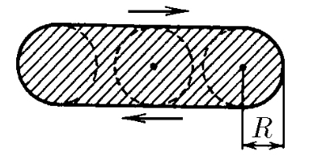
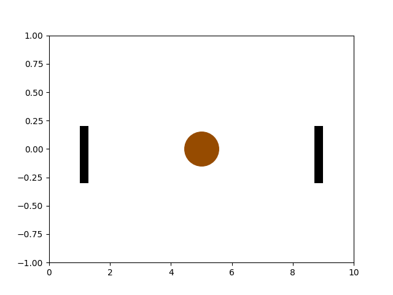

###  Условие: 

$3.3.15^*.$ Стрелок пытается попасть в диск радиуса $R$, который колеблется гармонически так быстро, что стрелок не может за ним уследить. Тогда он целится в центр области движения диска. С какой вероятностью стрелок попадет в диск, если амплитуда колебаний диска $a \gg R$? Если $A = 2R$? Увеличится ли вероятность попадания, если стрелок будет целиться в точку на расстоянии $R$ от края области? 

###  Решение: 

Перед просмотр решения рекомендую посмотреть решение задачи с похожим условием [1.1.23](../../ru/1/1.1.23)

  Движение мешени 

$\text{a) }$Гармоническое движение мишени описывается уравнением $$x(t) = a \cos\omega t$$ При этом период колебаний равен $$T = \frac{2\pi}{\omega}$$ Время за которое проходит цетр диска диапазон $[0; R]$ найдем как $$a \sin\omega t = R$$ $$\sin\omega t = \frac{R}{a}$$ Учитывая $a \gg R$, пользуемся приближением $\sin x \approx x$ $$\omega t = \frac{R}{a}$$ Откуда $t$ $$t = \frac{R}{\omega a}$$ Аналогично, время за которое проходит цетр диска диапазон $[-R; 0]$ равно $$t = \frac{R}{\omega a}$$ Тогда, время за которое проходит цетр диска диапазон $[-R; R]$ составляет $$t = \frac{2R}{\omega a}$$ Так как за время $T$ полного колебания, мишень проходит центр дважды, время в течении которого стрелок может попасть в мишень за промежуток $T$ $$\tau = \frac{4R}{\omega a}$$ Отсюда вероятность попадания $$w = \frac{\tau}{T} = \frac{4R}{\omega a} \frac{\omega}{2\pi}$$ $$\boxed{w = \frac{2R}{\pi a}}$$ $\text{b) }$Если $a = 2R$, то время за которое проходит цетр диска диапазон $[0; R]$ найдем как $$2R \sin\omega t = R$$ $$\sin\omega t = \frac{1}{2}$$ $$t = \frac{\pi}{6\omega}$$ Так как за время $T$ полного колебания, мишень проходит центр дважды, время в течении которого стрелок может попасть в мишень за промежуток $T$ $$\tau = 4t = \frac{4\pi}{6 \omega}$$ Отсюда вероятность попадания $$w = \frac{\tau}{T} = \frac{2\pi}{3 \omega} \frac{\omega}{2\pi}$$ $$\boxed{w=\frac{1}{3}}$$ Приближаяся к краю, скорость мишень уменьшается, соответственно увеличивается время, которое ее "видит" охотник, откуда и увеличивается вероятность попадания 

####  Ответ: 

$w = 2R/(\pi A)$ при $A \gg R$ 

$w = 1/3$ при $A = 2R$. Увеличится.

  

