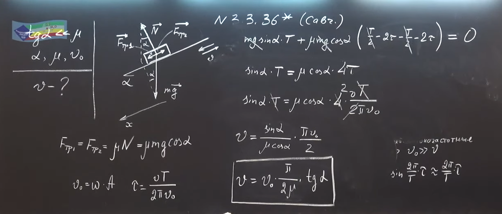

###  Условие: 

3.3.36*. Наклонная плоскость совершает гармонические колебания с большой частотой вдоль своей поверхности. Каково установившееся движение тела, находящегося на ней? Какова средняя скорость этого тела за большое время, если $\operatorname{tg} \alpha\ll \mu$, где $\alpha$ угол наклона плоскости, $\mu$ - коэффициент трения, $v_0$ амплитуда скорости наклонной плоскости? 

###  Решение: 

 

 

###  Ответ: $u_{\mathrm{cp}}=\pi v_0 \operatorname{tg} \alpha /(2 \mu )$ 

### 
