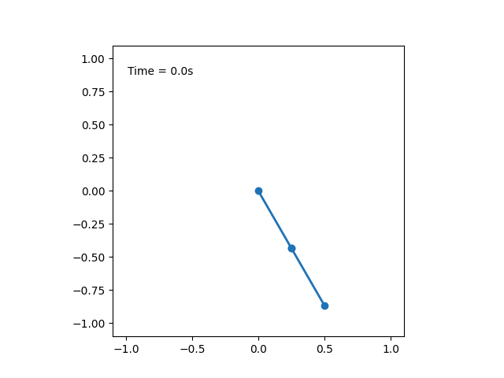

###  Условие:

$3.3.5.$ Найдите период колебаний математического маятника длины $l$, если на пути нити на расстоянии $l/2$ вниз по вертикали от точки подвеса вбит гвоздь.

###  Решение:

Ниже представлена анимация движения маятника, описанного в условии задачи

Первую часть пути "до гвоздя", маятник пройдет за время

$$
T_1 = \frac{1}{2} 2 \pi\sqrt{\frac{l}{g}} = \pi\sqrt{\frac{l}{g}} \quad \text{(1)}
$$

После соударения с гвоздем, половина его длина остается на месте, а остальная половина продолжает движение с той же скоростью

Таким образом, длина маятника уменьшается вдвое

$$
l\rightarrow \frac{l}{2}
$$

Делая замену в $\text{(1)}$

$$
T_2 = \pi\sqrt{\frac{l}{2g}}
$$

Таким образом полный период колебаний

$$
T = T_1+T_2
$$

$$
\boxed{T = (1 + 1/ \sqrt{2} )\pi\sqrt {\frac{l}{g}}}
$$

####  Ответ:

$$
T = (1 + 1/ \sqrt{2} )\pi\sqrt {\frac{l}{g}}
$$