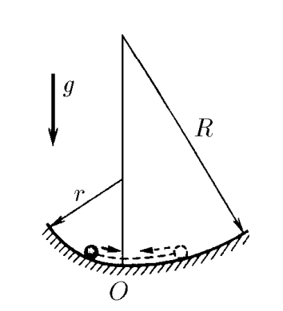

###  Условие:

$3.3.6.$ Найдите период колебаний тела в задаче [3.1.7](../3.1.7)

__Re:__ $3.1.7.$ Горизонтальный желоб слева от нижней линии выгнут по цилиндрической поверхности радиуса $r$, а справа — по поверхности радиуса $R$. Определите отношение наибольших отклонений влево и вправо при малых колебаниях тела в этом желобе.

###  Решение:

Аналогично [3.3.5](../3.3.5), колебания будут состоять из двух половинных-колебаний

Когда тело скользит по желобу радиуса $R$, его движение, с точки зрения кинематики, ни чем не отличается от движения математического маятника с длинной нити $R$

Таким образом, период колебаний составляет

$$
T_0 = 2\pi\sqrt{\frac{R}{g}}
$$

Т.е. половину желоба, он пройдет за время

$$
T_1 = \pi\sqrt{\frac{R}{g}}
$$

Аналогично, для желоба радиуса $r$

$$
T_2 = \pi\sqrt{\frac{r}{g}}
$$

Таким образом полный период колебаний

$$
T = T_1+T_2
$$

$$
\boxed{T = \pi \left(\sqrt{\frac{R}{g}}+\sqrt{\frac{r}{g}}\right)}
$$

#### Ответ:

$$
T = \pi \left(\sqrt{\frac{R}{g}}+\sqrt{\frac{r}{g}}\right)
$$