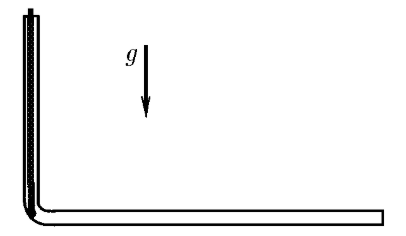

###  Условие: 

$3.3.7^*.$ Гладкую однородную веревку длины $l$ удерживают в вертикальном колене изогнутой трубы так, что нижний конец ее касается горизонтальной части трубы. Веревку отпускают. Через какое время она полностью окажется в горизонтальном колене? Трением пренебречь. Как изменится это время, если вначале часть веревки уже находилась в горизонтальном колене? 

###  Решение: 

 

####  Ответ: 

$$t = \frac{\pi}{2} \sqrt{\frac{l}{g}} \text{; не изменится}$$

  

