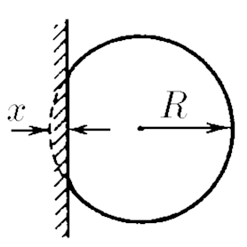
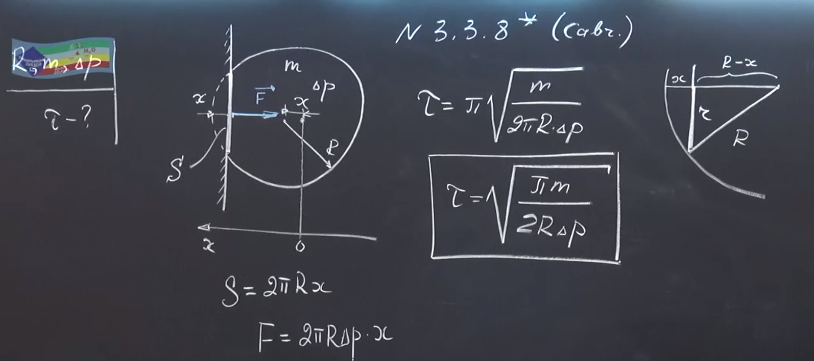

###  Условие: 

$3.3.8^*.$ Воздушный шарик при слабом ударе о стенку деформируется, как показано на рисунке. При этом максимальная деформация шарика $x$ много меньше его радиуса $R$. Пренебрегая изменением избыточного давления $\Delta p$ воздуха в шарике и упругостью оболочки, оцените время соударения со стенкой. Масса шарика $m$. 

 

###  Решение: 

 

 

###  Ответ: $t = \pi\sqrt{m/(2\pi R \Delta p)}$ 

### 
