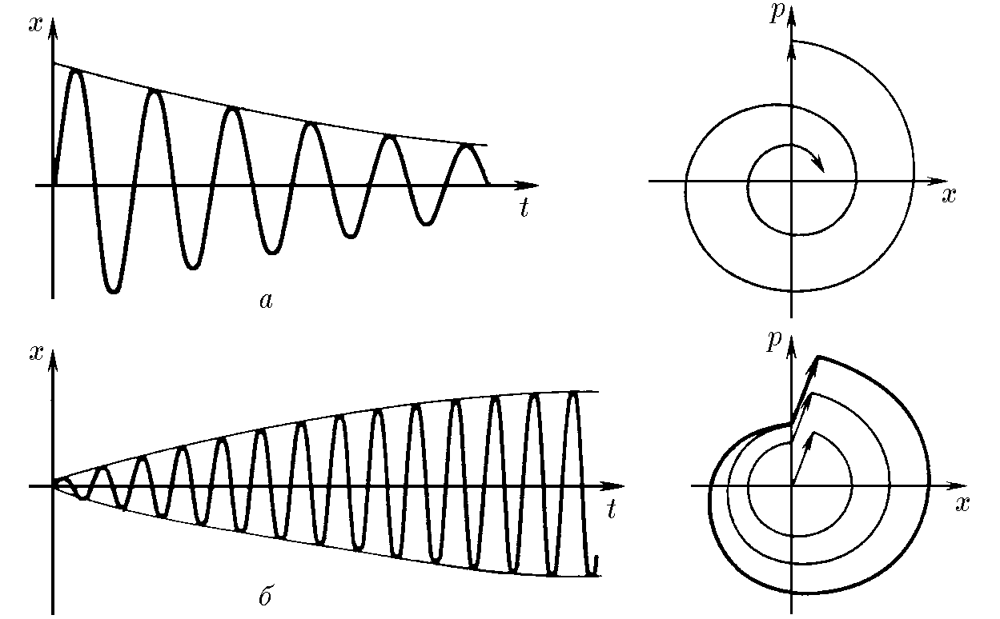

###  Условие: 

$3.5.11.$ Качественно опишите движение вначале покоившегося осциллятора под влиянием одиночного толчка и серии одинаковых толчков, следующих друг за другом через период, и постройте фазовый портрет этого осциллятора, если сила сопротивления движению пропорциональна его скорости. 

###  Решение: 

См. рис. а: после одиночного толчка происходит постепенное затухание колебаний; рис. б: при периодических толчках первоначально происходит раскачка колебаний, а затем, когда прирост энергии порядка pv сравнивается с потерями за период, имеющими порядок $bv^2T$, колебания устанавливаются. 

Примечание: В ответе рассмотрен реальный, а не идеализированный случай, когда толчки имеют не бесконечно малое время действия и все таки приводят к небольшому изменению координаты 
