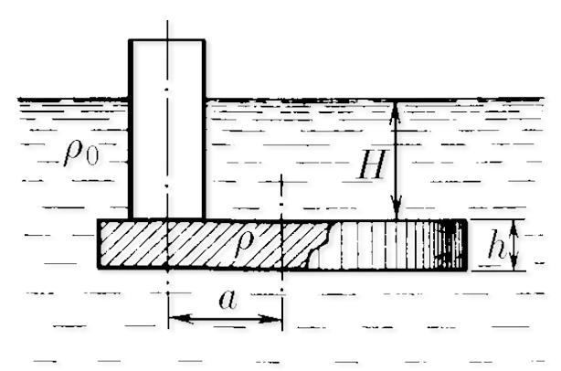

###  Условие:

$4.1.14.$ Трубка радиуса $r$ закрыта снизу металлическим диском и погружена в жидкость на глубину $H$. Радиус диска $R$, высота $h$. Ось диска отстоит от оси трубки на расстояние $a$. Плотность жидкости $\rho_0$, плотность металла $\rho$. До какой высоты нужно наливать жидкость в трубку, чтобы диск оторвался от трубки?

###  Решение:

На диск действуют сила Архимеда $\rho_0g\pi R^2h$, сила тяжести $\rho g\pi R^2h$, добавочное давление от столба воды в трубке и сила реакции

$$
mg + F_1 + N + \rho_0gx\pi r^2 = F_2 \quad \Rightarrow\\\ \rho\pi R^2hg+\rho_0gH\pi (R^2-r^2) + \rho_0gx\pi r^2 + N= \rho_0g(H+h)\pi R^2.
$$

После преобразований

$$
N+ (\rho -\rho_0)\pi R^2hg = \rho_0g(H-x)\pi r^2.
$$

А теперь запишем равенство моментов относительно, например, оси трубки:

$$
(\rho -\rho_0)\pi R^2gh\cdot a = M.
$$

Откуда должен появляться момент сил $M$? Логично, что из-за действия силы $N$. На самом деле когда мы набираем воду в трубку (увеличиваем $x$), то в какой-то предельный момент вода втекает под трубку как бы “сбоку”, то есть момента сил уже не хватает для того, чтобы уравновесить диск. Короче говоря, пока мы наливаем воду, распределение сил давления вдоль торца трубки меняется, и в целом точка приложения $N$ относительно оси трубки немного смещена на, допустим, величину $y$. Тогда

$$
M=Ny.
$$

Тогда, решая систему уравнений, получаем, что

$$
\boxed{x = H - h\left(\frac{\rho}{\rho_0} -1\right)\left(1+\frac{a}{y}\right)\frac{R^2}{r^2}}
$$

Из уравнения видно, что чем больше $x$, тем больше нужно $y$. В какой-то момент может случиться, что $y>r$, и, за невозможностью системе поддержать баланс при таких условиях, диск оторвётся от трубки. Делаешь замену $y\rightarrow r$ в конечном уравнении – это и будет твоим ответом.

####  Ответ:

$$
x=H-(R^{2}/r^{2})(1+a/r)(\rho /\rho_{0}-1)h
$$