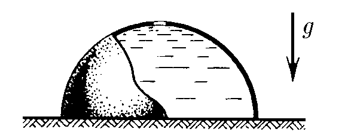

###  Условие: 

$4.1.17^*.$ В полусферический колокол, края которого плотно прилегают к поверхности стола, наливают через отверстие вверху жидкость. Когда жидкость доходит до отверстия, она приподнимает колокол и начинает из-под него течь. Найдите массу колокола, если его внутренний радиус равен $R$, а плотность жидкости $\rho$ 

###  Решение: 

 

 

###  Ответ: $m = \pi R^3\rho /3$ 

### 
