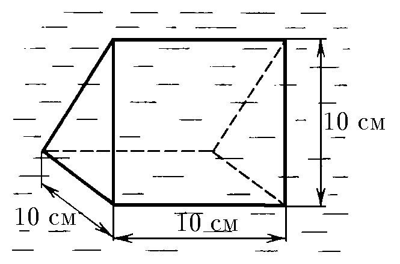
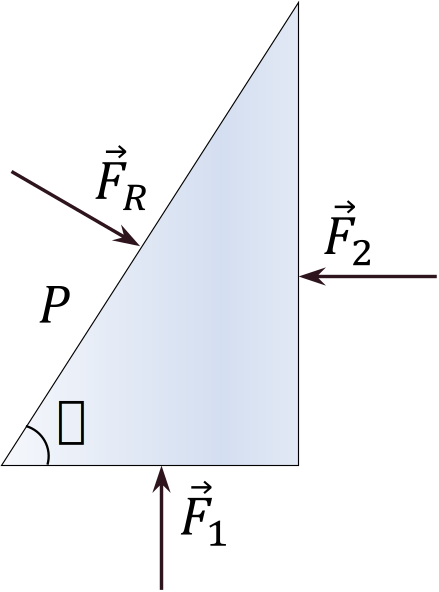

###  Условие: 

$4.1.2.$ В жидкости находится прямоугольная призма, размеры которой показаны на рисунке. Найдите сумму сил, действующих на переднюю и нижнюю грани призмы, если давление жидкости равно $2 \cdot 10^5$ Па. Чему равна сумма сил, действующих на призму? 

###  Решение: 

Давление на грани призмы:

\[
P = \rho \cdot g \cdot h = 2 \cdot 10^5 ~ \text{Па}.
\]

Так как размеры призмы малы относительно глубины, считаем давление постоянным по всей высоте.

Сила давления на переднюю и нижнюю грани равны и определяются через гидростатическое давление $P$ и площадь грани призмы:

\[
F_1 = F_2 = P \cdot a^2.
\]

Поскольку обе грани перпендикулярны, результирующую силу найдем по теореме Пифагора:
\[
|F_{\text{R}}| = \sqrt{F_1^2 + F_2^2} = 2000 \sqrt{2} ~ \text{Н}
\]

По закону Паскаля давление компенсируется, и результирующая сила:

\[
F_{\text{сум}} = 0.
\]

####  Ответ: $F_1 = 2000 \sqrt{2} ~Н, ~F_2 = 0$ 
