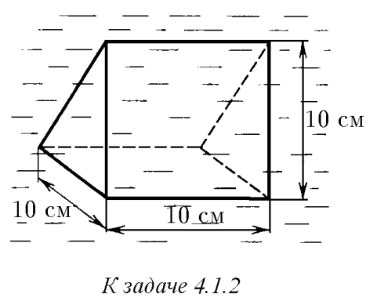
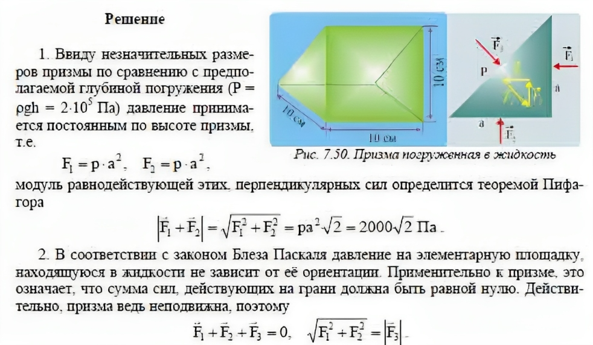

###  Условие: 

$4.1.2.$ В жидкости находится прямоугольная призма, размеры которой показаны на рисунке. Найдите сумму сил, действующих на переднюю и нижнюю грани призмы, если давление жидкости равно $2 \cdot 10^5$ Па. Чему равна сумма сил, действующих на призму? 

 

###  Решение: 

 

###  Ответ: $F_1 = 2000 \sqrt{2} \,Н \\\ F_2 = 0$ 

### 
