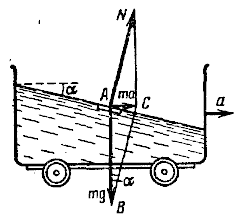
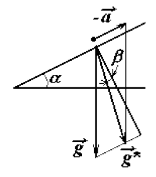

###  Условие: 

$4.1.22.$ Под каким углом к горизонту расположится поверхность жидкости в сосуде, скользящем по наклонной плоскости, составляющей угол $\alpha$ с горизонтом, если коэффициент трения равен $\mu$? 

###  Решение: 

Для начала, решим вспомогательную задачу 

На тележке стоит сосуд с жидкостью; тележка движется без трения с ускорением $a$ в горизонтальном направлении. Определить форму поверхности жидкости 

Выделим мысленно малый объем жидкости массой ту самой поверхности (рис.). При установившемся движении этот малый объем движется, как и вся тележка, с ускорением $a$. Силы, действующие на объем массой $m$, должны давать равнодействующую, равную $ma$, направленную в сторону ускорения. Этими силами будут сила тяжести $mg$ и сила реакции $N$ нижележащих слоев, нормальная к поверхности жидкости. Сила $N$ должна иметь такой модуль и направление, чтобы равнодействующая сил $N$ и $mg$ была равна $ma$. Тогда из треугольника $ABC$ мы будем иметь соотношение $ma = mg \tan\alpha$, откуда $$\boxed{\tan\alpha = a/g}$$ Следовательно, поверхность жидкости, перпендикулярная к силе реакции $N$, должна составлять с горизонтом угол $\alpha$, определяемый этим соотношением. 

Теперь вернемся к исходной задаче 

 

Теперь вернемся к исходной задаче 

Ускорение сосуда, скользящего по наклонной плоскости, определяется формулой $$a = g ( \sin\alpha - \mu\cos\alpha )$$ и направлено вдоль наклонной плоскости. 

Рассмотрим воду в системе отсчета, связанной с сосудом. Естественно, эта система неинерциальная. Можно ввести эффективное ускорение свободного падения $\vec{g}^{*} = \vec{g} - \vec{a}$. Поверхность воды перпендикулярна вектору $\vec{g}^{*}$ (так как в этой системе вода покоится). Из рисунка следует, что искомый угол $\beta$ определяется $$\tan\beta = \frac{g \sin\alpha - a}{ g \cos\alpha} = \mu$$ Относительно горизонта, угол будет составлять $$\boxed{\delta = \alpha − \arctan \mu}$$ 

####  Ответ: 

$$\beta = \alpha − \arctan \mu$$

  

