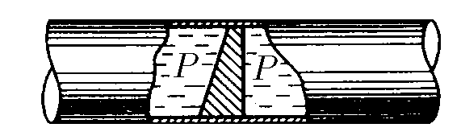
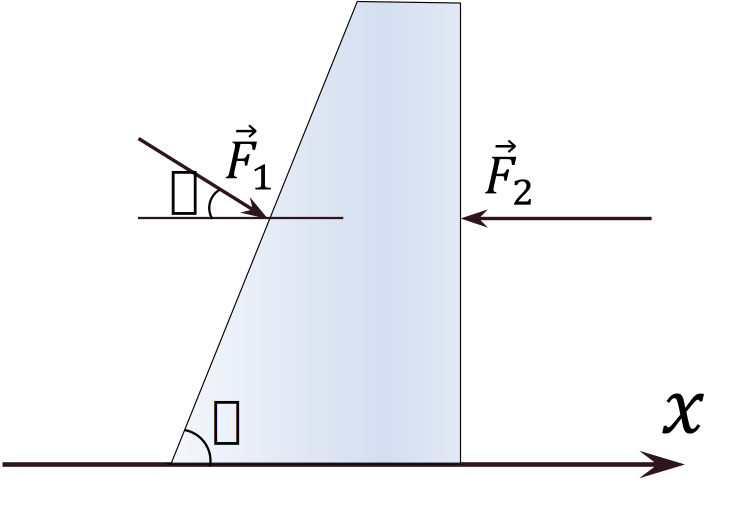

###  Условие:

$4.1.4.$ В трубе находится поршень, продольное сечение которого показано на рисунке. Давление жидкости с обеих сторон поршня одинаково. Находится ли поршень в равновесии?

###  Решение:

1\. Давление в трубе одинаково, а площади поверхностей поршня, соприкасающихся с водой ные, тогда из уравнения

$$
p = F/S,
$$

как бы следует, что поршень должен двигаться. Однако это не так. Проанализируем уравнение второго закона Ньютона

$$
\sum_{i=1}^{i=n} \vec{F}_i=\frac{d(m \vec{v})}{d t}
$$

2\. Поршень. расположенный в трубе. обладает одной степенью свободы, поэтому достаточно проанализировать только проекцию уравнения $(1)$ на ось $Ox$

$$
{F}_{{x}_1}-{F}_{{x}_2}=\frac{d}{dt}\left({mv_x}\right)
$$

векторы сил в данном случае перпендикулярны соответствующим поверхностям поршня, поэтому:

$$
{F}_1 \cos\alpha -{F}_2=0, \Rightarrow \boxed{\sum_1^{{n}} \vec{{F}}_{{k}}=0}
$$

#### Ответ: Да.