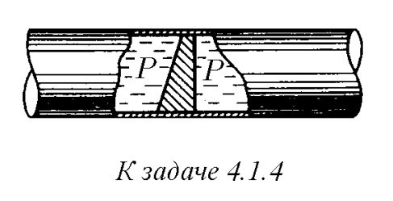

###  Условие: 

$4.1.4.$ В трубе находится поршень, продольное сечение которого показано на рисунке. Давление жидкости с обеих сторон поршня одинаково. Находится ли поршень в равновесии? 

 

###  Решение: 

 

1\. Давление в трубе одинаково, а площади по- верхностей поршня, соприкасающихся с водой ные, тогда из уравнения $р = F/S$, как бы следует, что поршень должен двигаться. Однако это не так. Проанализируем уравнение второго закона Ньютона $\sum_{i=1}^{i=n} \vec{F}_i=\frac{d(m \vec{v})}{d t}$ 2\. Поршень. расположенный в трубе. обладает одной степенью свободы, поэтому достаточно проанализировать только проекцию уравнения $(1)$ на ось $х$ $\mathrm{F}_{\mathrm{x} 1}-\mathrm{F}_{\mathrm{x} 2}=\mathrm{d}\left(\mathrm{mv_{ \textrm {x } }}\right) / \mathrm{dt}$ векторы сил в данном случае перпендикулярны соответствующим поверхностям поршня, поэтому: $\mathrm{F}_1 \cos\alpha -\mathrm{F}_2=0, \Rightarrow \sum_1^{\mathrm{n}} \vec{\mathrm{F}}_{\mathrm{k}}=0$

###  Ответ: Да. 

### 
