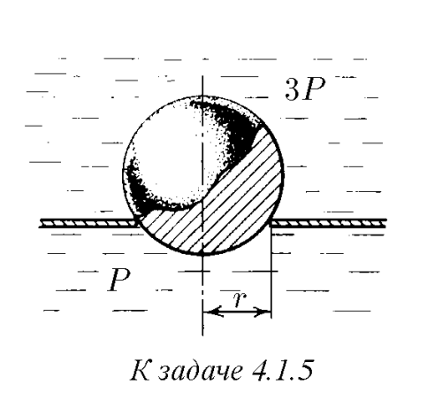

###  Условие: 

$4.1.5.$ В жидкости находится прямоугольная призма, размеры которой показаны на рисунке. Найдите сумму сил, действующих на переднюю и нижнюю грани призмы, если давление жидкости равно $2 \cdot 10^5$ Па. Чему равна сумма сил, действующих на призму? 

 

###  Решение: 

Шар перекрывает отверстие радиуса $г$ в плоской стенке, разделяющей жидкости, давление которых $Зp$ и $p$. С какой силой прижимается шар к отверстию? 1\. Сила, действующая со стороны жидкости на шар. будет определяться площадью поверхности раздела и разностью давлений по обе стороны пластины, т.е. $F= = (3p-p)s,$ $F=2p \cdot \pi r^2$

###  Ответ: $F = 2\pi r^2 P$ 

### 
