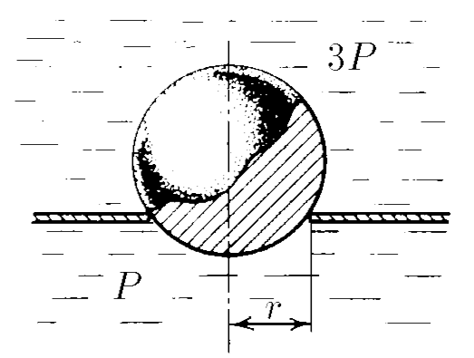

###  Условие:

$4.1.5.$ Шар перекрывает отверстие радиуса $r$ в плоской стенке, разделяю-
щей жидкости, давление которых $3P$ и $P$. С какой силой прижимается шар к
отверстию?

###  Решение:

Шар перекрывает отверстие радиуса $г$ в плоской стенке, разделяющей жидкости, давление которых $ЗP$ и $P$. С какой силой прижимается шар к отверстию?

Сила, действующая со стороны жидкости на шар. будет определяться площадью поверхности раздела и разностью давлений по обе стороны пластины, т.е.

$$
F = (3P-P)S \Rightarrow\boxed{ F=2P \cdot \pi r^2}
$$

#### Ответ: $F = 2\pi r^2 P$