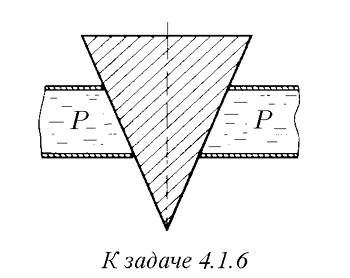
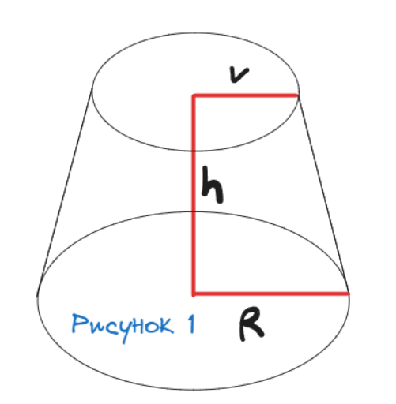
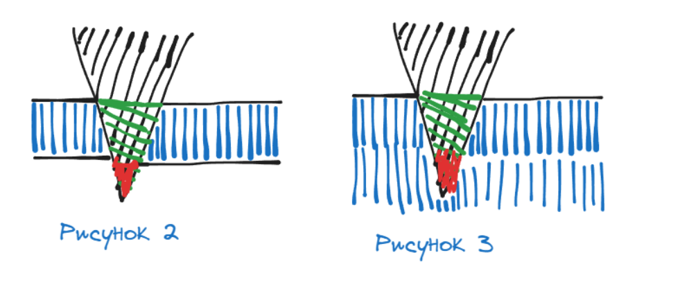

###  Условие: 

$4.1.6.$ Коническая пробка перекрывает сразу два отверстия в плоском сосуде, заполненном жидкостью при давлении $P$. Радиус отверстий $r$ и $R$. Определите силу, действующую на пробку со стороны жидкости. 

 

###  Решение: 

1) Часть пробки, которую перекрывают два отверстия в плоском сосуде, представляет собой усечённый конус. Его объём находится по формуле  $V=\frac{1}{3}\pi h(r^{2}+R^{2}+rR)$  2) Если бы у пробки "отпилили" красную часть и поместили так, чтобы она не касалась дна (рисунок 3), то ответом на вопрос задачи была бы формула силы Архимеда, где в качестве объёма фигурирует объём усечённого конуса (выделен зелёным цветом). Сила Архимеда - это сумма всех сил давления на все стороны тела. То есть, для ситуации на рисунке 3 её можно представить следующим образом: $F_{A}=\sum_{i}F_{i}+F_д$ где $F_д$—сила давления на нижнее основание усечёного конуса $F=F_{A}-F_{g}=pgV-s\cdot p$$=\frac{\rho g \pi h(r^{2}+R^{2}+rR)}{3} - \pi r^{2}\cdot p$ Т.к. $p=\rho g h:$ $F=\frac{p \pi (r^{2}+R^{2}+rR)}{3}-\frac{3\pi r^{2}\cdot p}{3}$ $F=\frac{\pi p(R^{2}+rR-2r^{2})}{3}$ 

###  Ответ: $F=\frac{\pi pd(R^{2}+rR-2r^{2})}{3}$ 

### 
