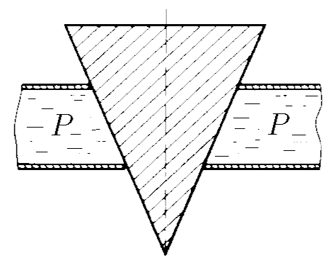

###  Условие: 

$4.1.6.$ Коническая пробка перекрывает сразу два отверстия в плоском сосуде, заполненном жидкостью при давлении $P$. Радиус отверстий $r$ и $R$. Определите силу, действующую на пробку со стороны жидкости. 

###  Решение: 

 

 

Пробка перекрывает два отверстия разного радиуса \( r \) и \( R \), образуя усечённый конус с высотой \( h \). Объём усечённого конуса вычисляется по формуле:  

$$V=\frac{1}{3}\pi h(r^{2}+R^{2}+rR)$$ 

Архимедова сила \( F_A \) равна весу вытесненной жидкости, а значит:  

\[
F_A = \rho g V
\]

где \( \rho \) — плотность жидкости, \( g \) — ускорение свободного падения.  
Подставляем объём усечённого конуса:

\[
F_A = \rho g \cdot \frac{1}{3} \pi h \left(r^2 + R^2 + rR\right)
\]

Давление жидкости действует на все поверхности пробки, но силу \( F \), действующую на пробку, можно представить как разность:  

\[
F = F_A - F_g
\]

где \( F_g \) — сила давления на нижнее основание пробки.  

Давление \( p \) на глубине \( h \):  

\[
p = \rho g h
\]

Сила \( F_g \), действующая на нижнее основание радиуса \( r \):  

\[
F_g = \pi r^2 p
\]

Подставляем значения в формулу \( F \):  

\[
F = \frac{\rho g \pi h \left(r^2 + R^2 + rR\right)}{3} - \pi r^2 p
\]

Заменяем \( \rho g h \) на \( p \):  

\[
F = \frac{\pi p \left(r^2 + R^2 + rR\right)}{3} - \pi r^2 p
\]

Приводим к общему знаменателю:  

\[
F = \frac{\pi p \left(R^2 + rR - 2r^2\right)}{3}
\]

###  Ответ: $F=\frac{\pi pd(R^{2}+rR-2r^{2})}{3}$ 
