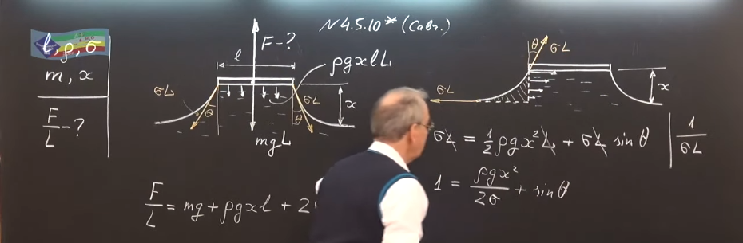

###  Условие: 

$4.5.10^{∗}.$ Длинная пластина ширины $l$ приведена в соприкосновение с поверхностью жидкости. Затем пластину стали поднимать. Как зависит сила, действующая на единицу длины пластины, от высоты ее подъема $x$? Плотность жидкости $\rho$, поверхностное натяжение $\sigma$. Масса единицы длины пластины $m$. 

###  Решение: 

 

 

 

 

 

###  Ответ: 

На рисунке изображены силы, действующие на участок пластины единичной длины (двойные стрелки), и силы, действующие на участки боковой поверхности жидкости единичной длины (жирные стрелки): $F_x-$искомая сила, $mg-$сила тяжести, действующая на пластину, $F_0=\rho gxl$ и $F_\parallel=\rho gx^2/2-$силы, вызываемые отрицательным давлением жидкости, $\sigma -$поверхностное натяжение. Из условия равновесия боковой поверхности жидкости следует, что: 

$$ F_{\parallel}=\rho gx^{2}/2=\sigma -\sigma\cos\theta$$

$$\quad\cos\theta =1-\rho gx^{2}/(2\sigma ). $$ 

Из условия равновесия пластины имеём 

$$ F_{x}=F_{0}+mg+2\sigma\sin\theta =mg+\rho gx(l+2\sqrt{\sigma /\rho g-x^{2}/4}\:). $$ 
