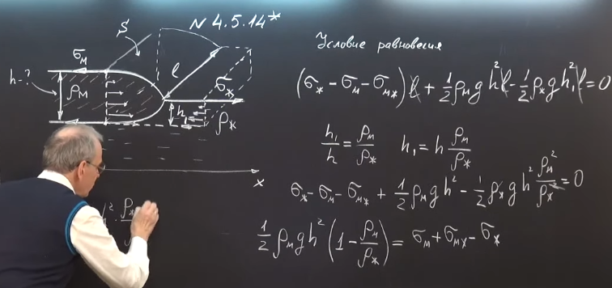
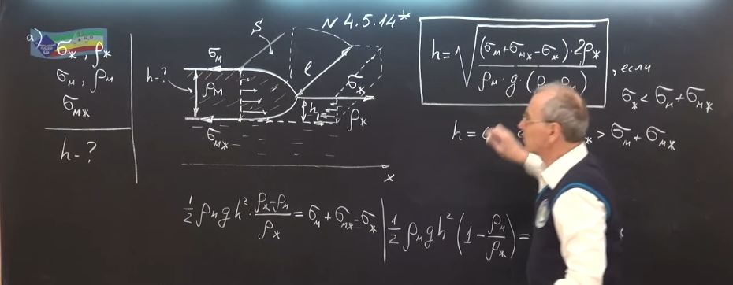
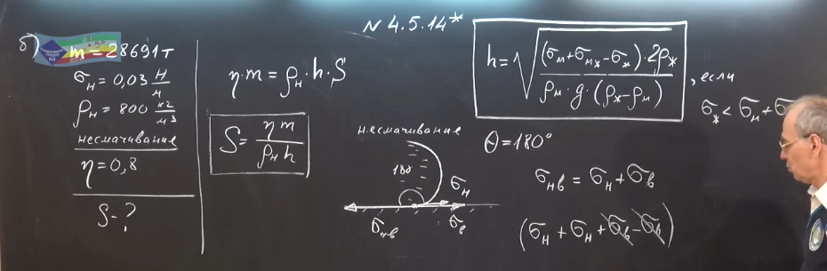
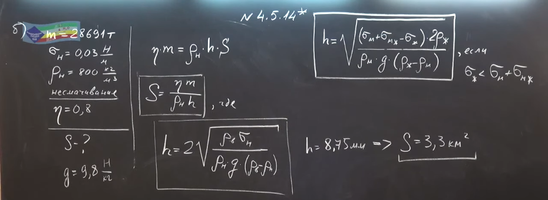
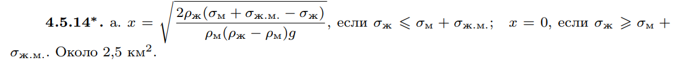

###  Условие: 

$4.5.14^{∗}.$ а. Большой участок жидкости покрыт слоем масла. Поверхностное натяжение и плотность жидкости $\sigma_ж$ и $\rho_ж$, поверхностное натяжение и плотность масла $\sigma_м$ и $\rho_м$, поверхностное натяжение границы жидкость–масло $\sigma_{ж.м}$. Определите толщину слоя масла. б. В 1977 г. «Арго-Мерчент», танкер водоизмещением $28\,691\,т$, напоролся на риф; корпус танкера развалился надвое, выплеснув в море полный груз нефти. Черные пятна нефти расползлись на тысячи квадратных миль. Определите общую площадь этих пятен. Поверхностное натяжение нефти $0.03\,Н/м$, плотность нефти $0.8 \cdot 10^3\cdotкг/м^3$, нефть не смачивается водой. Массу нефти принять равной $0.8$ водоизмещения танкера. 

###  Решение: 

 

 

 

 

 

###  Ответ: 

 
