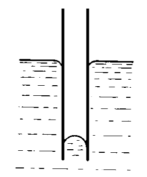

###  Условие:

$4.6.16^{∗}.$ С какой силой притягиваются друг к другу две параллельные квадратные пластины со стороной $a$, частично погруженные в жидкость, если они не смачиваются жидкостью? Плотность жидкости $\rho$, расстояние между пластинами $\Delta $, поверхностное натяжение жидкости $\sigma$.

###  Решение:

###  Ответ: $ F = 2a\sigma^2/(\rho g\Delta ^2)$