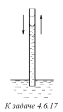
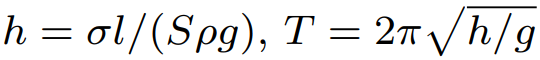

###  Условие: 

$4.6.17^{∗}.$ На какую высоту поднимется жидкость плотности $\rho$ в полностью смачиваемом капилляре, если его поперечное сечение $S$, а периметр этого сечения $l$? Как зависит период малых вертикальных колебаний жидкости в этом капилляре от высоты жидкости? Поверхностное натяжение жидкости $\sigma$. 

 

###  Решение: 

 

 

 

###  Ответ: 

 
