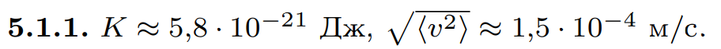

###  Условие: 

$5.1.1.$ Оцените среднюю кинетическую энергию и среднеквадратичную скорость частичек тумана диаметра $10$ мкм, находящихся в воздухе при температуре $5 \, ^{\circ}C$. 

###  Решение: 

 

 

###  Ответ: 

 

### 
